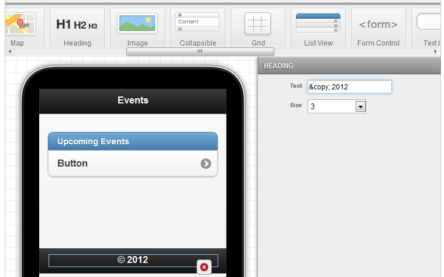
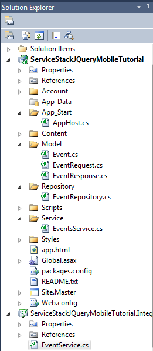
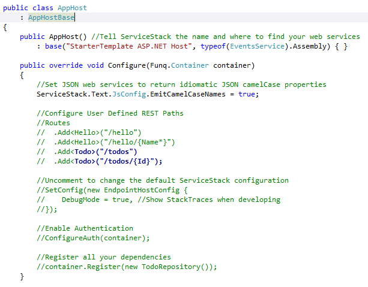
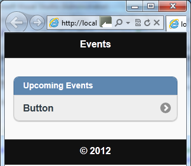

> _Outdated content warning._ The techniques in this article are now out of date. I'd be looking towards something like flutter or React Native today.

In a [previous](http://paymentnetworks.wordpress.com/2012/04/19/like-wcf-only-cleaner-9/) post, I wrote about making a simple web back using [ServiceStack](http://www.servicestack.net) back end that could serve up information about upcoming events. We automatically got SOAP, JSON, CSV and other end points. In today’s post, we’re going to look at a technique to consume them.

> Want more on ServiceStack? [ServiceStack 4 Cookbook](http://kylehodgson.com/servicestack-cookbook/) contains over 70 recipes on building quality services and applications with ServiceStack!

I fleshed out the services from the last blog post so that we now have a Registration service (for new registrations), an Event service (for editing / posting events) and an Events service (for downloading them).

Today we’ll build a [JQuery Mobile](http://jquerymobile.com/) app to view the events. One quick way to get started is to use the [Codiqa](http://www.codiqa.com/) demo on their home page. Codiqa is a great way to quickly prototype out JQuery Mobile apps. First add a header, then a footer, then a listview to the body. Double click the header and rename it “Events”. Double click on the Divider and rename it to “Upcoming Events”. Change the text of the footer to whatever you like – maybe a copyright notice. You should have something like the below:

If you click the download HTML button, you’ll get a zip file with an app.html file. More about that in a moment!

Fire up Visual Studio, create a new Project. Select ASP.NET Empty Web Application. Install the a NuGet package named servicestack.host.aspnet, as this will automatically install service stack, and create some demo files we don’t need. To get rid of them, delete the following:

- WebServiceExamples.cs
- Default.htm
- jqunback-1.51.min.js

Now, bring in the app.html that Codiqa created for us, and create folder for Model and Service. Create the following files from the first post:

- Model/Event.cs
- Model/EventRequest.cs
- Model/EventsResponse.cs
- Service/EventsService.cs

Your solution should look like this:

Next we have to remove the last traces of the demo from AppHost.cs. Find where it refers to HelloService and replace with EventsService. Also, comment or remove out the routing lines for the ToDo service, and comment out the registraion of the ToDoRepository. Now your AppHost.cs will look like this:

Now your solution should build. Right click app.html and choose “view in browser”. You should see the mobile app we designed in Codiqa.

More to follow in the next post!

<table style="margin:.2em 0;"><tbody><tr valign="top"><td style="padding:.5em;"><b>Note</b></td><td style="border-left:3px solid #e8e8e8;padding:.5em;"><b>Service Stack Series</b>

This article is one of a three part series on Service Stack. <a href="http://kylehodgson.com/tag/service-stack/">View All Articles</a> <a href="https://github.com/kylehodgson/servicestacktutorial">View Complete Source Code</a></td></tr></tbody></table>
