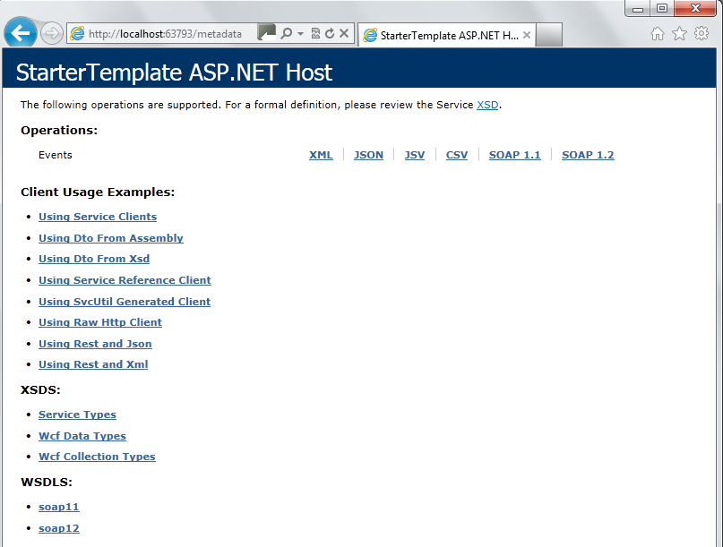
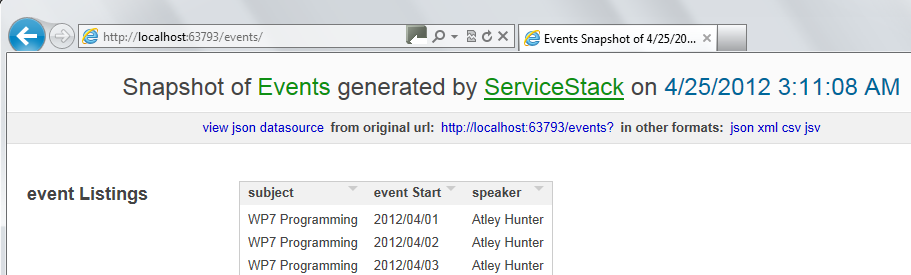
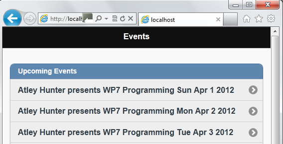

In our previous post, we covered the basics of setting up Visual Studio to support our project – adding Service Stack, removing demo classes we don’t need, and plugging in our basic model and services – we even copied a basic JQueryMobile app.html in to our project. However, we haven’t done anything yet. In today’s post, we’ll poke around and see what we have – then we’ll wire up some JavaScript to make the JQueryMobile app start to connect to the back end.

> Want more on ServiceStack? [ServiceStack 4 Cookbook](http://kylehodgson.com/servicestack-cookbook/) contains over 70 recipes on building quality services and applications with ServiceStack!

Now that you can display the app.html in a browser, let’s try something else: visit the URL /metadata/. You should see something like the following:



ServiceStack has created a helpful metadata page with links to XSD, WSDL, and other documentation for connecting to your service, including links to documentation on the ServiceStack page on how to create one line clients in C#. You can see we have an Events operation that’s linked to our EventsService. View the JSON link shows us documentation of how to call the Events service via JavaScript, which boils down connecting to /events?format=json. This should be easy to hit with JavaScript!

Before we can continue we’re going to need some dummy data. In my project I’ve created an EventRepository that creates some fake event data for us on the fly with a simple for loop as per below:

```csharp
public enum EventRepositoryResponse
{
    Success,
    DateAlreadyPresent
}

public class EventRepository
{
    private List<Event> _repo;
    public EventRepository()
    {
        _repo = new List<Event>();
        InitializeTestData();
    }

    public EventRepository(object repo)
    {
        _repo = repo as List<Event>;
    }

    internal List<Event> GetEvents()
    {
        return _repo;
    }

    internal Event GetEvent(string subject)
    {
        return (_repo.Where(e => e.Subject.ToLower() == subject.ToLower())).FirstOrDefault();
    }

    internal EventRepositoryResponse SaveEvent(Event eve)
    {
        var count = (from e in _repo where e.EventStart == eve.EventStart select e).Count();
        if (count > 0) return EventRepositoryResponse.DateAlreadyPresent;
        _repo.Add(eve);
        return EventRepositoryResponse.Success;
    }

    internal int GetCountOfEvents()
    {
        return GetCountOfEvents(null);
    }

    internal int GetCountOfEvents(string searchTerm)
    {
        if (searchTerm == null) return _repo.Count;
        return _repo.Count(e => (e.Subject.Contains(searchTerm)));
    }

    internal void InitializeTestData()
    {
        int recordsToMake = 20;
        for (int i = 1; i < recordsToMake; i++)
        {
            _repo.Add(
                new Event
                {
                    EventStart = new DateTime(2012, 4, i),
                    Speaker = "Atley Hunter",
                    Subject = "WP7 Programming"
                });
        }
    }
}
```

Now we can wire that up to our EventsService like so:

```csharp
public class EventsService : RestServiceBase<EventRequest>
{
    private EventRepository repository;
    public EventsService()
    {
        repository = new EventRepository();
    }
    public EventsService(EventRepository repo)
    {
        repository = repo;
    }

    public override object OnGet(EventRequest request)
    {
        var list = repository.GetEvents();
        var output = new EventResponse
        {
            EventListings = list
        };

        return output;
    }
}
```

We’re not doing paging yet, but that’ll come soon enough. Before we can work with the EventRepository we need to adjust AppHost again, by adding the following line to Configure:

container.Register(new EventRepository());

After doing this, we should be able to hit the /events/ URL and see something like the following, thanks to ServiceStack’s built in HTML5 data viewer:



So, now we know our repository is wired up and working. Next, we just need some simple JavaScript to get the app.html using this data source. Codiqa should have created a `script` block at the bottom of the app.html page. Find it, and plug in the following :

```javascript
$(document).ready(function () {

    jQuery.getJSON("/events?format=json",

        function (data) {

            for (var idx in data.eventListings) {

                var listing = data.eventListings[idx];
                var date = new Date(parseInt(listing.eventStart.substr(6)));

                $("#listview_events").append(
                                        '<li data-theme="c">' +
                                        '<a href="#" data-transition="slide">' + listing.speaker
                                        + ' presents ' + listing.subject + ' '
                                        + date.toDateString()  + '</a></li>');
            }

            $("#listview_events").listview('refresh');
        });
});
```

For this to work, you’re going to have to locate the listview in app.html and add an id to it. In the example above, I chose listview\_events. What this tells the page to do is connect to our local events URL, request it in JSON format, then add a list item to the listview for each one. Once finished, we call listview(‘refresh’) so that JQueryMobile can work its magic and apply styling and functionality to the list. With all of this in place, if we view app.html again we should see the following:



Voila, we have a basic service back end and a very basic HTML5 mobile app talking to it.

<table style="margin:.2em 0;"><tbody><tr valign="top"><td style="padding:.5em;"><b><span style="text-decoration:underline;">Note</span></b></td><td style="border-left:3px solid #e8e8e8;padding:.5em;"><b>Service Stack Series</b><div></div>This article is one of a three part series on Service Stack. <a href="http://kylehodgson.com/tag/service-stack/">View All Articles</a> <a href="https://github.com/kylehodgson/servicestacktutorial">View Complete Source Code</a></td></tr></tbody></table>
