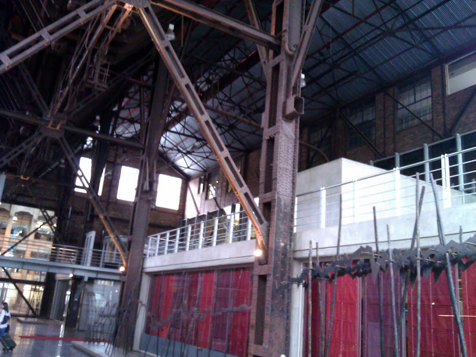

I’ve had the good fortune to be sent on an assignment to the [Johannesburg Thoughtworks](http://join.thoughtworks.com/south-africa) office to help with training on a few things. I haven’t had much time to plan, but so far it’s been a lot of fun.

* * *

## Neighborgoods Market

On a suggestion from a colleague, a few of us headed over to [Neighborgoods Market](http://www.neighbourgoodsmarket.co.za/) in nearby Braamfontein for lunch. It was a really amazing scene. It could have been mistaken for a local food movement market in Brooklyn if it wasn’t for all of the billtong and other South African local treats. The food was fantastic, local micro-breweries were serving beer and cider, wineries had stalls so you could get a nice local red or white by the glass. I had a great steak sandwich from a local farm, but I wished I had held out and looked around more - the sandwich was really tasty, but there were far more exotic things to be had.

**Photos courtesy of [Neighborgoods Market](http://www.neighbourgoodsmarket.co.za/)**  
   

* * *

## Jo’burg Walking Tour

The local office arranged a _walking_ tour of Johannesburg given by ardent explorer [Gerald Garner](http://www.joburgplaces.com/gerald/index.htm). This is somewhat unconventional, as Jo’burg has a reputation for not being pedestrian friendly. Gerald is defeating that idea one group of tourists at a time as he leads people on a five hour walking tour of the city that is a passionately produced mix of history, tourist spots, urban planning, wonderful hotels, socio-economics and restaurants.

Our tour started in Braamfontein right next to Neighborgoods Market. We started with a great view of the city and the [Nelson Mandela Bridge](http://en.wikipedia.org/wiki/Nelson_Mandela_Bridge) from the exclusive roof top [Randlords](http://www.randlords.co.za/) nightclub, then through trendy Braamfontein. We hopped on a [Rea Vaya](http://www.reavaya.org.za/) BRT bus at Ellis Park. Rea Vaya is a great concept - it borrows a lot from tram systems; the bus stations are all raised platforms with automated sliding glass doors, electronic entrance systems, and a dedicated bus lane make this a very pleasant, very non-bus like experience.

As per the description on the official site, The tour visits public art in the Newtown area as well as Turbine Hall, the Walter & Albertina Sisulu sculpture, Chancellor House, the Anglo American Campus including the Leaping Impala Sculpture, Darkie Cafe, the architecture and mining artefacts along Main Street Mall, Gandhi Square, the historic core around City Hall (Gauteng Legislature, Barbican Building and Rissik Street Post Office), Ernest Oppenheimer Park, Eloff Street and Kerk Street shopping district. Also included are the many trendy spots in Braamfontein, including coffee shops, hotels and some rooftops.

Though we saw so many things, Old Turbine Hall in Newton left a big impression on me. As the story goes, it was built in the 1930’s as an electrical generation station that operated through the 1970’s. In the troubled 1990’s, the facility had become a derelict and very dangerous, causing people who worked at the nearby Johannesburg Stock Exchange to hire armed guards so as to walk from their parking lot to work.

Today the site has been completely revamped as part of a project to build a headquarters for the AngloGold Ashanti mining company, and is very much a public space with beautiful gardens and great architecture while maintaining the original power of the historic building. It’s a great renewal story, just one of so many that we heard about Johannesburg.

* * *

## Dinner

We decided to head over to [Duke’s Burgers](http://www.tripadvisor.ca/Restaurant_Review-g312578-d3246190-Reviews-Duke_s_Burgers-Johannesburg_Johannesburg_Gauteng.html) in [Greenside](http://en.wikipedia.org/wiki/Greenside,_Gauteng). Greenside is a trendy, upscale entertainment & restaurant district and was very lively even at 7:30 PM. I had the tasty "If Pigs Could Fly" burger with a salad. The name is probably a reference to the fact that it was ostrich meat, though I can’t explain how. We had some great local beer, and even better conversation.

**References**

1. [http://www.joburgplaces.com/tours/index.htm](http://www.joburgplaces.com/tours/index.htm)
2. [http://www.gauteng.net/attractions/entry/turbine\_hall/](http://www.gauteng.net/attractions/entry/turbine_hall/)
3. [http://lizatlancaster.co.za/blog/the-old-turbine-hall-given-a-new-life-as-anglo-gold-ashantis-headquarters](http://lizatlancaster.co.za/blog/the-old-turbine-hall-given-a-new-life-as-anglo-gold-ashantis-headquarters)
4. [http://www.tripadvisor.ca/Restaurant\_Review-g312578-d3246190-Reviews-Duke\_s\_Burgers-Johannesburg\_Johannesburg\_Gauteng.html](http://www.tripadvisor.ca/Restaurant_Review-g312578-d3246190-Reviews-Duke_s_Burgers-Johannesburg_Johannesburg_Gauteng.html)

<table style="margin:.2em 0;"><tbody><tr valign="top"><td style="padding:.5em;">
<b><u>Note</u></b>
</td><td style="border-left:3px solid #e8e8e8;padding:.5em;">
<b>South Africa Series</b>
This article is one of a four part series on South Africa. <a href="http://kylehodgson.com/tag/south-africa/">View All Articles</a></td></tr></tbody></table>
