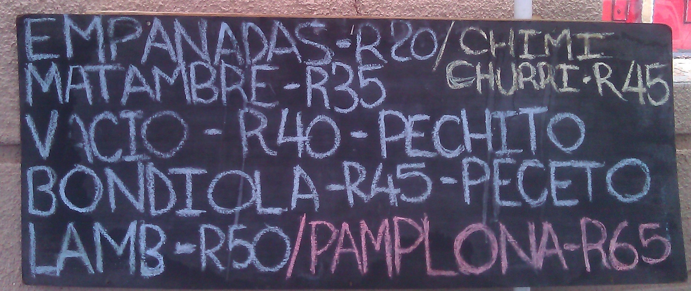

I woke up a bit later on Sunday, day two of my trip. The plan for the day was to head to [Arts on Main](http://marketonmain.co.za/), a market open every Sunday and the third Thursday of each month. Like Neighborgoods, it has lovely handmade food, but it adds more in the way of crafts, art. I wanted to keep packing in as much as I could over the weekend before I had to head to the [ThoughtWorks office](http://join.thoughtworks.com/south-africa) on Monday.

* * *

## Arts on Main

The first thing I needed to do was take out some of the local currency (rand, or ZAR for short) as markets are very cash based. There was an ATM nearby, but that didn’t work - there was a line up of people trying to use it. One of the people in line with us, a local, offered that she knew where an ATM was, but that it was a few blocks away and would appreciate it if we would walk with her. My two companions, two more people that were waiting, and our guide struck out on foot a few blocks. We passed by a gas station and mechanic shop that was busy with repairing several local mini-bus taxis. That ATM didn’t work either, so we headed back. Luckily we met up with two other colleagues who had a few hundred rand extra (about $40 USD) so that we could grab lunch.

* * *

## Lunch

My colleagues and I headed over to an Argentinian stand right outside the market that was barbecuing chicken, and had some beautiful beef roast as well that they were making sandwiches out of. I wish I’d tried the empanadas, they looked excellent.

Inside we also found a Chinese food stall, a mother and daughter team. They had dim sum on, bao, steamed pork buns, pork and prawn dumplings. Very tasty!

We headed out to the courtyard outside and there was a vendor roasting coffee beans on a little charcoal fire, and making what I think of as a camp fire version of espresso. It was excellent.

**Argentinian food stall, Arts on Main**  

**Coffee Roasted and Prepared on the Spot**  

* * *

## Designer Shopping with Local Flavor

I picked up a really great t-shirt with a picture of the iconic Johannesburg skyline at a [Love Jozi](http://www.lovejozi.co.za/t/latest-t-shirts/freerange) shop selling designer clothing. They had all sorts of great stuff, and the prices were amazingly reasonable - as most things are here.

**Love Jozi Shop**  

* * *

## The Canteen

Next we went upstairs to a bar called The Canteen that was playing salsa music. People were dancing and having a great time. It was fun.

* * *

## Rosebank Mall

I headed back towards the apartment after spending a few lovely hours in Arts on Main. On the way, we stopped off at a local shopping mall, which I expected to be fairly pedestrian - it was anything but. It turns out that on Sundays they run a [massive local crafts market](http://www.themallofrosebank.co.za/market-rosebank-mall.htm) on their rooftop area. I had good luck shopping.

For dinner later that night I headed back to Rosebank Mall for curry at an Indian chain called Bombay Blues. Probably the most expensive meal I’ve eaten in Jo’burg so far at 245 ZAR, but it was fairly good.

**References**

1. [Arts on Main Market](http://marketonmain.co.za/)
2. [Love Jozi Free Range T-Shirts](http://www.lovejozi.co.za/t/latest-t-shirts/freerange)
3. [The Canteen](http://www.eatout.co.za/Restaurants/6885/Johannesburg/Light-meals-Seafood-Grills-International-Italian/The-Canteen)
4. [Rosebank Mall](http://www.themallofrosebank.co.za/)

<table style="margin:.2em 0;"><tbody><tr valign="top"><td style="padding:.5em;">
<b><u>Note</u></b>
</td><td style="border-left:3px solid #e8e8e8;padding:.5em;">
<b>South Africa Series</b>
This article is one of a four part series on South Africa. <a href="http://kylehodgson.com/tag/south-africa/">View All Articles</a></td></tr></tbody></table>
