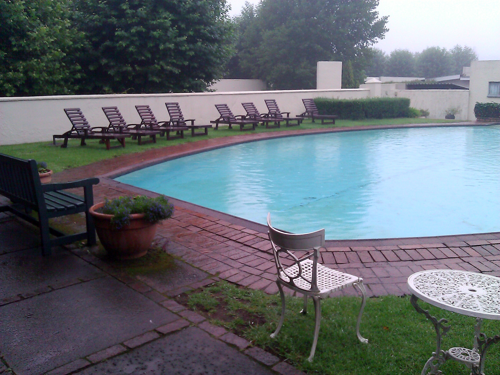

After a really great first week in the [ThoughtWorks](http://join.thoughtworks.com/south-africa) Braamfontein office, a little sight-seeing was in order. At my friend [Rob’s](http://robenslin.com/) suggestion, six of us packed in to two cars headed north east in to the mountains and South Africa’s beautiful Blyde River Canyon area to view the sites along the [Panorama Route](http://www.sa-venues.com/maps/mpumalanga-panorama-route.htm).

* * *

## Getting out of the city

We headed out Saturday morning around 10:30 AM along the N4 highway. We got out of the city, and made a quick stop for lunch in a small town called [Waterval Boven](http://en.wikipedia.org/wiki/Waterval_Boven), which is known for rock climbing. Most of the restaurants were closed, and the kitchens at the pubs were also closed, so we had lunch in the tourist center. Grilled ham and cheese sandwiches with tea hit the spot, and we were back on the road again in under an hour. The staff at the tourist centre were warm and friendly. Apparently, one must watch out for baboons - they come down out of the hills at night looking for food.

**View up the hills from Waterval Boven**  

* * *

## In to the mountains

We started heading north, and in to the mountains. The car started to strain more and more as we climbed. Roads were in good shape, with beautiful views down in to the valley below.

**Views from the highway**  

* * *

## On to God’s Window

We passed through Sabie, and then [Graskop](http://en.wikipedia.org/wiki/Graskop) where our accommodation was arranged. About 5 km beyond Graskop is a tourist site named [God’s Window](http://en.wikipedia.org/wiki/God%27s_Window#God.27s_Window), and was our main destination for the trip. As you drive in to the park, you follow a short path to an incredible vantage point where the views are rumored to be amazing, in part due to a 700 meter drop off in to the Lowveld. Unfortunately, we had encountered intense fog for the past half hour, and when we arrived at God’s Window it had still not dissipated. This would become a recurring theme.

**The most beautiful view in South Africa (when its not foggy)**  

* * *

## Graskop

Disappointed and hungry, we headed back to Graskop to check in to the hotel. We had made arrangements to stay at the [Graskop Hotel](http://www.graskophotel.co.za/). The hotel worked really well - plenty of rooms, clean, modern, good value for money. Breakfast downstairs was included. There was a nice pub downstairs with a fireplace, and also an Art Gallery on site. There was an exhibit on of local artists.

**Graskop Hotel**  

* * *

## Canimambo

After we checked in, we headed over to a local Portuguese restaurant called [Canimambo](http://www.tripadvisor.ca/ShowUserReviews-g424918-d1583729-r135855029-Canimambo_Restaurant-Graskop_Mpumalanga.html) for food, libation and company. All three were excellent. Amazing food, great value, great service. We ordered tapas, I had a great cut of beef, and all my friends seemed happy with our food. We hung out for a while, and eventually adjourned to the attached lounge for a nightcap. The trip was definitely starting to look up.

* * *

## Bourke’s Luck Potholes

Where the Treur River meets the Bylde River, water erosion has caused a series of incredible rock formations known locally as [Burke’s Luck Potholes](http://www.sa-venues.com/attractionsmpl/bourkes-luck-potholes.htm). It’s a great two to three hour visit. A quick walk down from the visitor’s center leads you to a bridge, which takes you across the river where you can get a fantastic view. On the other side is a gorgeous waterfall and an incredible rock ledge to walk around. The rocks are all fantastically colored, and the whole scene is quite breathtaking.

**Bourke’s Luck Potholes**  

* * *

## Trip Home

After that, we headed back in to Graskop for lunch. We ate at the famous [Harrie’s Pancakes](http://www.harriespancakes.com/), and then headed back to God’s Window hoping our fortunes would improve. To our dismay, the cloud cover and fog were still far too dense to see anything more than ten meters away. We packed it in and headed back to the city.

Harrie’s does both savoury and sweet pancakes. The presentation was excellent, as was the service and the food. Highly recommended.

**Harrie’s Pancakes**  

While the weather didn’t participate, we still had a lovely time. If you’re ever nearby, the Panorama promises these and many other amazing scenes - well worth the trip.

* * *

## Links

**Places we visited**

1. [Panorama Route](http://www.sa-venues.com/maps/mpumalanga-panorama-route.htm)
2. [Canimambo](http://www.canimambo.za.net/)
3. [ThoughtWorks South Africa](http://join.thoughtworks.com/south-africa)
4. [Panorama Route](http://www.sa-venues.com/maps/mpumalanga-panorama-route.htm)
5. [Harrie’s Pancakes](http://www.harriespancakes.com/)
6. [Burke’s Luck Potholes](http://www.sa-venues.com/attractionsmpl/bourkes-luck-potholes.htm)
7. [Graskop Hotel](http://www.graskophotel.co.za/)

<table style="margin:.2em 0;"><tbody><tr valign="top"><td style="padding:.5em;">
<b><u>Note</u></b>
</td><td style="border-left:3px solid #e8e8e8;padding:.5em;">
<b>South Africa Series</b>
This article is one of a four part series on South Africa. <a href="http://kylehodgson.com/tag/south-africa/">View All Articles</a></td></tr></tbody></table>
