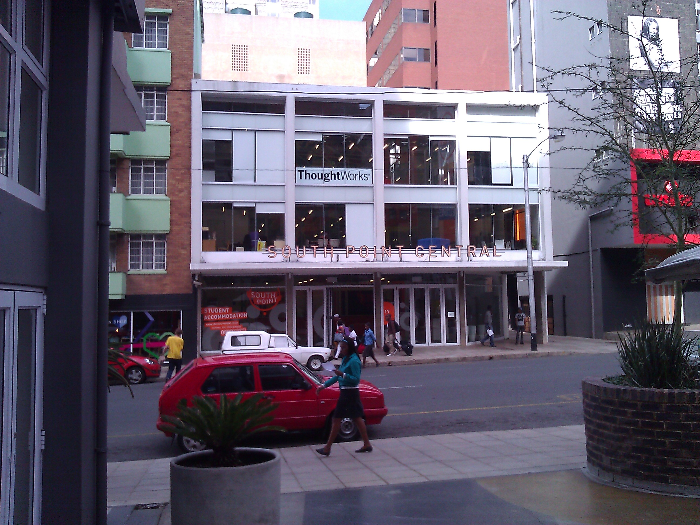

The [ThoughtWorks office in Johannesburg](http://join.thoughtworks.com/south-africa) is in part defined by what neighborhood we chose to move in to. Most companies in Jo’burg move to Sandton - a very white, very affluent neighborhood that’s most known for its security. [Braamfontein](http://www.braamfontein.org.za/), where ThoughtWorks is putting down roots, is very different - it’s a vibrant, international, up and coming neighborhood very close to [Witwatersrand University](http://www.wits.ac.za). Braam, as it’s known, has very recently received a massive facelift by real estate developer South Point with a focus on urban student living. Just down two flights of stairs you have the excellent Double Shot and [Velo](https://www.facebook.com/ulovevelo) to choose from for amazing coffee, and Velo has great food too. [Double Shot’s mayor-hood](https://foursquare.com/v/double-shot-tea—coffee/4e96a22b29c2e086370930d3) is hotly contested on FourSquare due to their 3PM special. There are tons of options for food too, from all over the world. It has all the ingredients of a great tech centre: students, coffee, and really great, inexpensive real estate.

**ThoughtWorks Office**  

**Street Level Opposite ThoughtWorks (With Cricket on TV)**  

**Velo Coffee Shop**  

**ThoughtWorks Entrance**  

* * *

## Office Space

The space itself is super functional, very "vibey", modern with clean lines. Most walls are glass, and most glass is in use in the various projects happening in the office.

**Pairing Stations**  

**Drawings from a Black Girls Code Meetup**  

**Project Card Wall**  

**Kitchen**  

**Shared Space**  

* * *

## Neighborhood

The neighborhood bars and restaurants have a very similar modern, cool feel. The bars could have been transplanted right out of scene-conscious Brooklyn or a hip Bay Area neighborhood. Case in point, we had a going away party for one of the Jo’burg staff over at [Great Dane](https://www.facebook.com/greatdanebar). Great sausages, beautiful weather, cold beer, amazing patio. Very Braamfontein.

**Lunch at Great Dane**  

**Great Dane’s Patio**  

* * *

## Tech Community

ThoughtWorks is big in the tech community in Johannesburg, as you might imagine. I’m very impressed with their use of Meetup.com - they have a really great site going called ["Coded in Braam"](http://www.codedinbraam.co.za). While I was there they participated in the [Global Day of Code Retreat](http://coderetreat.org/events/coded-in-braam-hosts-global-day-of-code-retreat) and had a really great turnout. Also, they’ve been involved in [Black Girls Code](https://www.facebook.com/BlackGirlsCodeJohannesburg) and had a fantastic turnout at an event back in October. From what I understand well over 50 girls came, and participated in an all day event.

* * *

## Wrap up

I’m back in wintery Toronto now, and happy to be home, but I’ll always have a special place in my heart for the amazing people in [ThoughtWorks South Africa](http://join.thoughtworks.com/south-africa). I had a great time - and I thoroughly encourage anyone who has the opportunity to go!

<table style="margin:.2em 0;"><tbody><tr valign="top"><td style="padding:.5em;">
<b><u>Note</u></b>
</td><td style="border-left:3px solid #e8e8e8;padding:.5em;">
<b>South Africa Series</b>
This article is one of a four part series on South Africa. <a href="http://kylehodgson.com/tag/south-africa/">View All Articles</a></td></tr></tbody></table>
