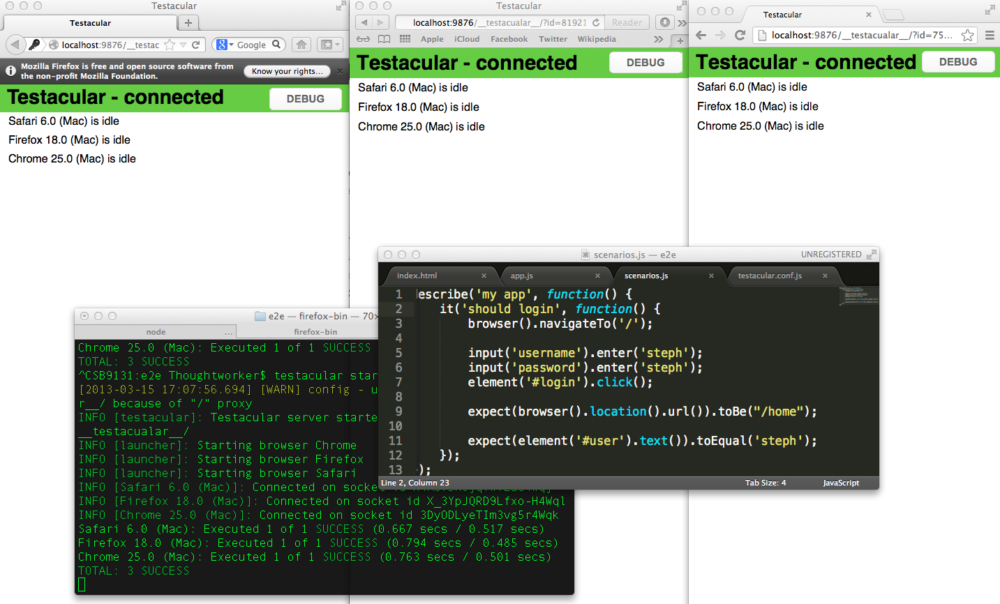

> _Outdated content warning._ The techniques in this article are now out of date. Google no longer supports the "E2E" testing framework. [7 Reasons to love Duck Angular](http://kylehodgson.com/2014/04/29/seven-reasons-to-love-duck-angular/) covers a more modern approach to testing Angular applications.

<table style="margin:.2em 0;"><tbody><tr valign="top"><td style="padding:.5em;"><b>Note</b></td><td style="border-left:3px solid #e8e8e8;padding:.5em;"><b>Special Collaboration</b>

<em>This article is a special collaboration between <a href="https://github.com/stephanebisson">Stephane Bisson</a>, who developed the concept, the app, and the spec, and <a href="http://www.kylehodgson.com">Kyle Hodgson</a> who helped write and produce the article.</em></td></tr></tbody></table>

* * *

## The Problem

Testing [AngularJS](http://angularjs.org/) applications with Selenium can be difficult! I’ve seen teams struggle with waits and timeouts, writing jQuery selectors, and all sorts of complicated things to work around these limitations. Selenium, and in particular Selenium with WebDriver, can be a challenge when working with any "Web 2.0" site, and a single page application built with Angular presents even bigger challenges. Part of the challenge is that Selenium doesn’t know when Angular is finished adding functionality to the page.

* * *

## Enter E2E

Angular’s team has developed a project called ["E2E"](http://docs.angularjs.org/guide/dev_guide.e2e-testing), or the "End to End" testing framework. It allows developers to test in multiple browsers at the same time, while your output scrolls past on a terminal every time you change your code without having to re-run a slow functional test. It doesn’t do everything Selenium does, but it’s much much faster at running tests on AngularJS sites.

* * *

## Getting Started

Create an application. For instance, here’s a simple, but [well structured example app](https://github.com/stephanebisson/e2e-example). You’ll also need have e2e and testacular installed.

<table style="margin:.2em 0;" border="0" width="100%" bgcolor="#e8e8e8"><tbody><tr><td style="padding:.5em;"><pre style="margin:0;padding:0;">sudo npm install -g  testacular</pre></td></tr></tbody></table>

If you’re in the directory with the index.html and app.js, you can start a simple web server on port 8000 like this:

<table style="margin:.2em 0;" border="0" width="100%" bgcolor="#e8e8e8"><tbody><tr><td style="padding:.5em;"><pre style="margin:0;padding:0;">python -m SimpleHTTPServer</pre></td></tr></tbody></table>

* * *

## Set up Testacular

You’ll need to create a testacular config file. It’s easy to specify the browsers, by using the testacular init command. It asks you a few questions and creates the file for you. That process looks like this, you can see us provide some sensible defaults below.

<table style="margin:.2em 0;" border="0" width="100%" bgcolor="#e8e8e8"><tbody><tr><td style="padding:.5em;"><pre style="margin:0;padding:0;">$ testacular  init

Which testing framework do you want to use ?
Press tab to list possible options. Enter to move to the next question.
&gt; jasmine

Do you want to capture a browser automatically ?
Press tab to list possible options. Enter empty string to move to the next question.
&gt; Chrome
&gt; Firefox
&gt; Safari

Which files do you want to test ?
You can use glob patterns, eg. "js/*.js" or "test/**/*Spec.js".
Enter empty string to move to the next question.
&gt; spec/**/*.js

Do you want Testacular to watch all the files and run the tests on change ?
Press tab to list possible options.
&gt; yes</pre></td></tr></tbody></table>

* * *

## The Spec

Write a simple test scenario. If you’re used to Jasmine’s approach you might think of this like a Jasmine spec.

<table border="0" width="100%" cellpadding="10" bgcolor="#e8e8e8"><tbody><tr><td><pre><tt><b>describe</b>('my app', <b>function</b>() {
        <b>it</b>('should login', <b>function</b>() {
                <b>browser</b>().<b>navigateTo</b>('/');

                <b>input</b>('username').<b>enter</b>('steph');
                <b>input</b>('password').<b>enter</b>('steph');
                <b>element</b>('#login').<b>click</b>();

                <b>expect</b>(<b>browser</b>().<b>location</b>().<b>url</b>()).<b>toBe</b>("/home");

                <b>expect</b>(<b>element</b>('#user').<b>text</b>()).<b>toEqual</b>('steph');
        });
});</tt></pre></td></tr></tbody></table>

* * *

## Start Testacular

Once you start testacular, it’s going to watch your source code files for changes, and automatically display the test results on the console.

<table style="margin:.2em 0;" border="0" width="100%" bgcolor="#e8e8e8"><tbody><tr><td style="padding:.5em;"><pre style="margin:0;padding:0;">testacular start &lt;name-of-config-file.js&gt;</pre></td></tr></tbody></table>

Edit your app or your tests and see it run! The end result looks something like this:

As you can see, tested in all three browsers with test output in the console. Voila! I love this workflow - keep your favorite text editor open, keep a terminal open, watch your tests go red and green while you work.
