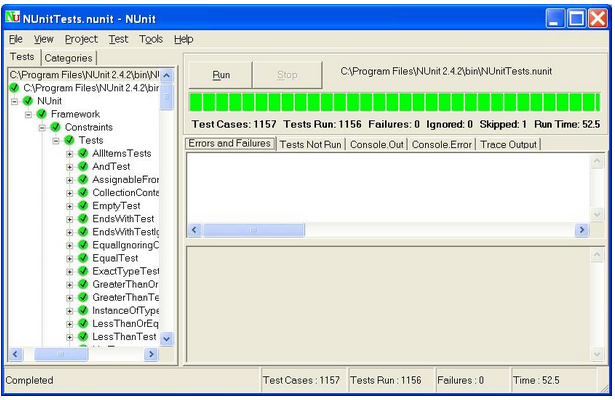
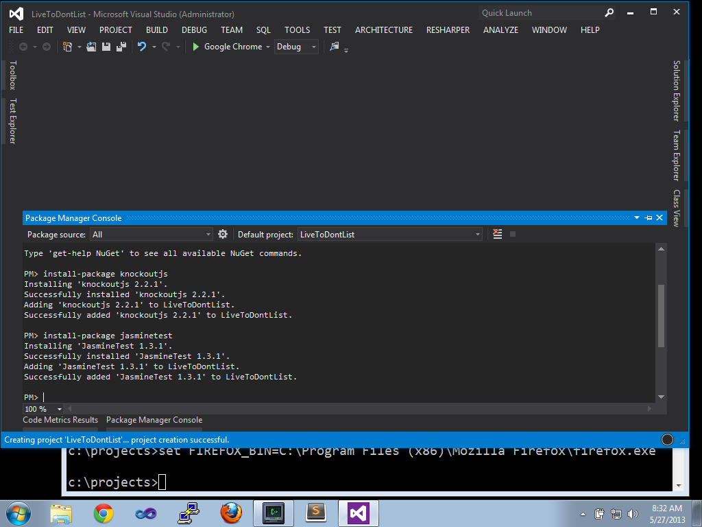
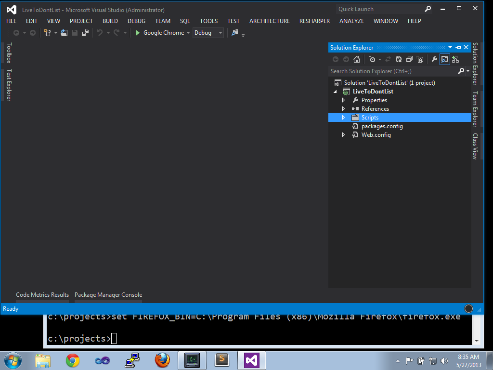
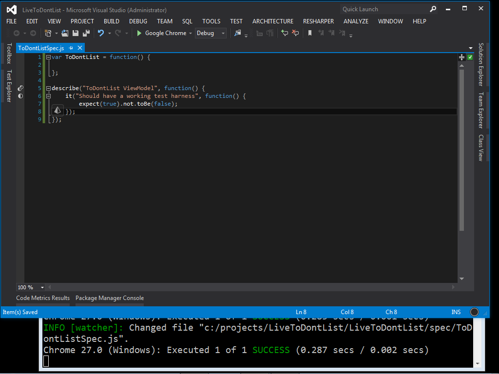

I’m giving a presentation on KnockoutJS and TDD at DevTeach in Toronto on Wednesday. I’ll be doing a live code demo, which is always exciting (at least for the presenter). I thought I’d write a quick article recording the steps I go through as part of the demo.

* * *

## Legacy Code

Legacy Code, according to my favorite definition by [Michael Feathers](http://www.amazon.ca/books/dp/0131177052), is any source code that doesn’t have sufficient tests. This picture pretty well sums up the way I feel when I have to deal with legacy code. It’s possible to get your job done, but it’s tricky.

**Could you please replace the green cable there?**  


You’ve just opened up the hood to figure out what’s wrong, and now you have that sinking feeling. "If I change this code, what else could happen that I didn’t intend?" Unit testing can help give you confidence that changes to your code can be made safely. It helps with a whole host of issues; since you can now change your code safely, it’s much easier to consider going in and cleaning up code to make it more expressive, more manageable. You can do all of that stuff you learned about reading [Clean Code](http://www.amazon.ca/Clean-Code-Handbook-Software-Craftsmanship/dp/0132350882) without worrying about unintended side effects.

**Snake Charmer**  


With a proper suite of unit tests in place, it’s much safer to make changes. It took me way too long to realize this, but the easiest way to make sure you have a great suite of unit tests is to practice some form of Test Driven Development (TDD) or Behavior Driven Development (BDD). Since you write the tests first in these practices, you never have to go back and try to shoe horn your code in to a test harness. Also, if you wrote the tests before the code, you wrote the tests already, so there’s no risk you’re going to skip them when the schedule gets tight.

* * *

## TDD In a Nutshell

Popularized by [Kent Beck](http://en.wikipedia.org/wiki/Kent_Beck) in the 1990’s, [Test-Driven Development](http://en.wikipedia.org/wiki/Test_Driven_Development) (TDD for short) is a design technique that drives code design through tests. You continually cycle through the following three states:

**Red**  
You write your tests before there is software to test, so by definition they’re going to start out failing.

**Green**  
You then write enough code to make the tests pass. Most test systems represent this with the color green.

**Refactor**  
Now that you have your code under test, it’s a great time to go in and refactor things and clean them up.

<table style="margin:.2em 0;"><tbody><tr valign="top"><td style="padding:.5em;"><p><b><u>Note</u></b></p></td><td style="border-left:3px solid #e8e8e8;padding:.5em;">There’s a number of great <a href="http://www.amazon.com/gp/product/0321146530?ie=UTF8&amp;tag=martinfowlerc-20&amp;linkCode=as2&amp;camp=1789&amp;creative=9325&amp;creativeASIN=0321146530">books</a> and <a href="http://martinfowler.com/bliki/TestDrivenDevelopment.html">articles</a> on TDD out there if you’d like more on the subject.</td></tr></tbody></table>

* * *

## Example Application

Let’s write some software, shall we? Let’s imagine a busy executive who has a To Don’t list. It’s a list of things that they’d like to make sure that they do not do.

**Epic Level User Story**

As a busy executive,
I would like to keep a list of things that aren't very important to me,
So that I make sure that I focus on higher value work.

* * *

## Getting the Tools Installed

We’re going to look at doing TDD with Vojta Jina’s [Karma](http://karma-runner.github.io/) testing library (formerly called testacular), Visual Studio, and [KnockoutJS](http://www.knockoutjs.com). However, many of the techniques could just as easily apply to [vim](http://www.vim.org) and [AngularJS](http://www.angularjs.org).

**Dependencies:**

- [Nuget](http://www.nuget.org)
- [NPM](http://nodejs.org/download/) (the NodeJS Package Manager)
- Visual Studio

Fire up a command line terminal and install karma with this npm command:

**Installing NPM Packages**

```
npm install -g karma
```

Next, create a Visual Studio project. I choose the Empty ASP.NET MVC project. Then, in the Package Manager console I add what I need. We don’t strictly need to use nuget to install Jasmine, as karma will pull it down; but its helpful to install the Nuget package as then Visual Studio will be able to autocomplete Jasmine syntax JavaScript.

**Nuget Packages**

```
install-package knockoutjs
install-package jasminetest
```



However, the jasminetest nuget package does bring in several folders you don’t need; I delete Controllers, Views, Content right away. After deleting those folders, my project looks like this in Visual Studio:



You’re going to need environment variables for the different browsers you want to test with. My environment variables batch file looks like this:

**toDontEnv.bat**

```
c:\projects\ToDontList>more toDontEnv.bat
set HOME=c:\users\khodgson\
set PATH=%PATH%;c:\nuget\
set CHROME_BIN=%HOME%\AppData\Local\Google\Chrome\Application\chrome.exe
set IE_BIN=C:\Program Files\Internet Explorer\iexplore.exe
set PHANTOMJS_BIN=%HOME%\AppData\Roaming\npm\phantomjs.cmd
set FIREFOX_BIN=C:\Program Files (x86)\Mozilla Firefox\firefox.exe
```

Next up initialize karma by running karma init in your project directory. Doing so will create a file called karma.conf.js that holds your selected answers, it’s simple to change things later by editing the file. The karma init command walks you through some fairly sane options, such as the default [Jasmine](http://pivotal.github.io/jasmine/) spec syntax and making sure you have at least one browser configured. Note the answers to the questions "which files do you want to test" - the pattern src/\*\*/\*.js matches any file that ends with js in any directory underneath the relative path src. Likewise, spec/\*\*/\*Spec\*.js will match any file that contains the word Spec under the spec relative path and all of its subdirectories.

**Steps:**

- change directories to your .NET Solution’s project folder
- Run karma init
- Choose jasmine for the test framework
- Choose no to Require.js
- Choose Chrome as your browser
- When prompted for "what files do you want to test":
    - enter the full path to the source code for KnockoutJS
    - it’s important not to include the source for multiple versions of knockout accidentally, so I type out the full path instead to the knockout that I want Karma to test against
    - enter src/**\*/**.js for our source files
    - enter spec/**\*/\*Spec**.js for our spec files

**Karma**

```
c:\projects\LiveToDontList\LiveToDontList>karma init

Which testing framework do you want to use ?
Press tab to list possible options. Enter to move to the next question.
> jasmine

Do you want to use Require.js ?
This will add Require.js adapter into files.
Press tab to list possible options. Enter to move to the next question.
> no

Do you want to capture a browser automatically ?
Press tab to list possible options. Enter empty string to move to the next question.
> Chrome
>

Which files do you want to test ?
You can use glob patterns, eg. "js/*.js" or "test/**/*Spec.js".
Enter empty string to move to the next question.
> src/**/*.js
WARN [init]: There is no file matching this pattern.

> spec/**/*Spec*.js
WARN [init]: There is no file matching this pattern.

> Scripts/knockout-2.2.1.js
>

Any files you want to exclude ?
You can use glob patterns, eg. "**/*.swp".
Enter empty string to move to the next question.
>

Do you want Testacular to watch all the files and run the tests on change ?
Press tab to list possible options.
> yes

Config file generated at "c:\projects\LiveToDontList\LiveToDontList\karma.conf.js".
```

* * *

## Creating The First Spec

Let’s start with this user story:

**User Story**

As a busy executive,
I would like to enter new items,
So that I can remember not to do them.

**Acceptance Criteria**

Given that the exec is viewing the application,
When there are no previous items,
Then the exec will see an empty list.

Given that the exec has entered a title and description,
When creating the new item,
Then the starting status is incomplete.

This starting spec has just enough in it to prove that our test harness is working. If you created folders for src and spec and then started karma with karma start, you should be able make a new file called ToDontListSpec.js in this folder. If you arrange your screen so that you can see Visual Studio and the command line terminal with Karma running in it, any time you save your changes in Visual Studio karma will re-run your tests and you can see the output immediately as soon as you’ve hit save.

**Steps**

- Create src directory
- Create spec directory
- Create new item (Ctrl-shift-a) in the spec folder, choose JavaScript file as the type
- Name it ToDontListSpec.js
- Start karma by typing karma start

**Source code for ToDontListSpec.js (for now):**

```javascript
var ToDontList = function() {

};

describe("ToDontList View Model",function() {
        it("Has a working test harness",function() {
                expect(true).not.toBe(false);
        });
});
```
**VisualStudio and Karma**  


The describe section begins the test suite - in this suite we’ll put all of our tests for the ViewModel we’re building for our first page, so we start with describe("ToDontList View Model") {}. The next line starts our first actual test with the it() function. The expect() function lets you make assertions about the code - in this case, that true is not false. The Jasmine toBe() method matches with the JavaScript \=== syntax; while toEqual() uses \==. The not() method, as you might expect, applies a logical NOT to the assertion. With a little luck, this test passes. I like Jasmine’s BDD style syntax, I find it much more expressive than the Assert.AreEqual(expected,actual) style.

What we see below is a test that describes how we expect the API to work for adding a new item.

**Add this source code to the describe("ToDontList ViewModel") block in ToDontListSpec.js:**

```javascript
var test_item = {"title": "Test title","description": "Test description", "complete": false};
it("Should be able to add items",function() {
        var target = new ToDontList();
        target.add_item(test_item);
        expect(target.items()[0].title).toBe(test_item.title);
});
```

With these lines inside of the describe() function from before, Jasmine should now instantiate one of our (currently empty) ViewModel objects, then try to execute the add\_item method (which we haven’t written yet) with an argument that’s a basic JavaScript test object. In a unit test we often speak of "Arrange, Act, and Assert":

- Arrange: Creating the test\_item and the var target = new ToDontList(); instantiation arranges the background
- Act: target.add\_item(test\_item); exercises the unit
- Assert: expect(target.items()\[0\]).toBe(test\_item) sets out what we expect to happen

The entire source file looks like this at this stage:

**ToDontListSpec.js**

```javascript
var ToDontList = function () {

};

describe("ToDontList View Model", function () {
    it("Has a working test harness", function () {
        expect(true).not.toBe(false);
    });
    var test_item = { "title": "Test title", "description": "Test description", "complete": false };
    it("Should be able to add items", function () {
        var target = new ToDontList();
        target.add_item(test_item);
        expect(target.items()[0].title).toBe(test_item.title);
    });
});
```
And my test results look like this:

```
INFO [watcher]: Changed file "c:/projects/LiveToDontList/LiveToDontList/spec/ToDontListSpec.js".
Chrome 26.0 (Windows) ViewModel Should be able to add new items FAILED
        TypeError: Object [object Object] has no method 'add_item'
            at null.<anonymous> (c:/projects/LiveToDontList/LiveToDontList/spec/ToDontListSpec.js:12:16)
Chrome 26.0 (Windows): Executed 2 of 2 (1 FAILED) (0.281 secs / 0.005 secs)
```

This is the "red" part of the red / green / refactor cycle. The next step is to make the test pass. We’ll need to add a method add\_item at a minimum.

* * *

## Make the tests pass

You may have noticed that we haven’t created a source file for our View Model yet - that’s OK, for now we’ll keep all our code in one place while it’s small. Also, this helps us delay the decision of what to name the file, where to put it and so on; all we have is a /src/ and /spec/ directory so far. We’re letting our design emerge naturally.

We do need to make this test pass however. So, let’s try this for starters:

**Changes to the ToDontList function in ToDontListSpec.js:**

```javascript
var ToDontList = function () {
    var self = this;
    self.items = ko.observableArray();

    self.add_item = function(item) {
        self.items.push(item);
    };
};
```

An observableArray is a Knockout feature, that as you may imagine, provides an array that you can use to bind to view items bi-directionally. It’s not immediately obvious that the items inside the observableArray are not themselves observable; changes to these items will not trigger binding; but adding or removing items from an observableArray will.

When I save this file, I see the following test results in my karma runner window:

**Much better**

```
Chrome 26.0 (Windows): Executed 2 of 2 SUCCESS (0.077 secs / 0.002 secs)
```

* * *

## Next Story

Let’s move on with a little more functionality.

**User Story**

As a busy executive,
I would like to see the list of items I've saved previously,
So that I can remember what they were.

**Acceptance Criteria**

Given that the exec is viewing the main view,
When there are existing items,
Then they should be listed there.

We can simulate that easily enough with test items. For this next spec, we’re going to want a list of items that we can pass in to our ViewModel object to simulate getting an initial list of items from the server. Let’s refactor by renaming our test\_item from before as test\_item1, and add a test\_item2 and an array test\_items that contains both of them to support our scenario. While we’re at it, we can delete the expect(true).not.toBe(false) spec, as we now know we have a working test harness. Afterwards, our code should look like this:

**New contents of ToDontListSpec.js:**

```javascript
var ToDontList = function () {
    var self = this;
    self.items = ko.observableArray();

    self.add_item = function (item) {
        self.items.push(item);
    };
};

describe("ToDontList View Model", function () {
    var test_item1 = { "title": "Test title", "description": "Test description", "complete": false };
    var test_item2 = { "title": "Another test title", "description": "Another test description", "complete": false };
    var test_items = [test_item1, test_item2];

    it("Should be able to add items", function () {
        var target = new ToDontList();
        target.add_item(test_item1);
        expect(target.items()[0].title).toBe(test_item1.title);
    });

});
```

Now that we’ve refactored a bit, and our tests still pass, we can add a new spec for our new user story like this:

**Add a new spec to the ToDontListSpec.js suite:**

```javascript
it("Should be able to view existing items", function () {
    var target = new ToDontList(test_items);
    expect(target.items().length).toBe(2);
    expect(target.items()[0].title).toBe(test_item1.title);
    expect(target.items()[1].title).toBe(test_item2.title);
});
```

This spec is expecting that our ViewModel object now accepts an argument that’s a list of items. The test expects the object to have initialized items() with the two items provided in the initial list. We haven’t implemented this functionality (we’re back to red), so when I hit Ctrl-S in Visual Studio the Karma error output looks like this:

```
INFO [watcher]: Changed file "c:/projects/LiveToDontList/LiveToDontList/spec/ToDontListSpec.js".
Chrome 27.0 (Windows) ToDontList View Model Should be able to view existing items FAILED
        Expected 0 to be 2.
        Error: Expected 0 to be 2.
            at null.<anonymous> (c:/projects/LiveToDontList/LiveToDontList/spec/ToDontListSpec.js:23:39)
        TypeError: Cannot read property 'title' of undefined
            at null.<anonymous> (c:/projects/LiveToDontList/LiveToDontList/spec/ToDontListSpec.js:24:33)
Chrome 27.0 (Windows): Executed 2 of 2 (1 FAILED) (0.353 secs / 0.006 secs)
```

One quick change to the ViewModel to add the new required functionality however and we should be back to green:

```javascript
var ToDontList = function (initialItems) {
    var self = this;

    if (!(initialItems instanceof Array))
        initialItems = [];
    self.items = ko.observableArray(initialItems);

    self.add_item = function(item) {
        self.items.push(item);
    };
};
```

Now what we’re doing is giving our ViewModel function an argument where you can pass in any existing items. If an array is passed in to the observableArray, Knockout will ingest any initial items, such as from the server on page load. With this code in place, the tests go green:

```
INFO [watcher]: Changed file "c:/projects/LiveToDontList/LiveToDontList/spec/ToDontListSpec.js".
Chrome 27.0 (Windows): Executed 2 of 2 SUCCESS (0.298 secs / 0.003 secs)
```

* * *

## Progress so far

So far we’ve started up our Visual Studio project, installed the necessary components, configured them, created a basic test harness, and we’ve begun writing code. In the next article, we’ll look at creating the page, booting Knockout, and adding more features. Watch this space!

<table style="margin:.2em 0;"><tbody><tr valign="top"><td style="padding:.5em;"><p><b><u>Note</u></b></p></td><td style="border-left:3px solid #e8e8e8;padding:.5em;">This article is part of a multi-part series on Test Driven JavaScript development. The code for this particular project can be found on <a href="https://github.com/kylehodgson/ToDontList">GitHub</a>. You can view all the articles by viewing the <a href="http://kylehodgson.com/tag/tdd-knockout/">tdd-knockout</a> tag.</td></tr></tbody></table>
