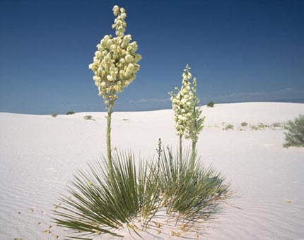
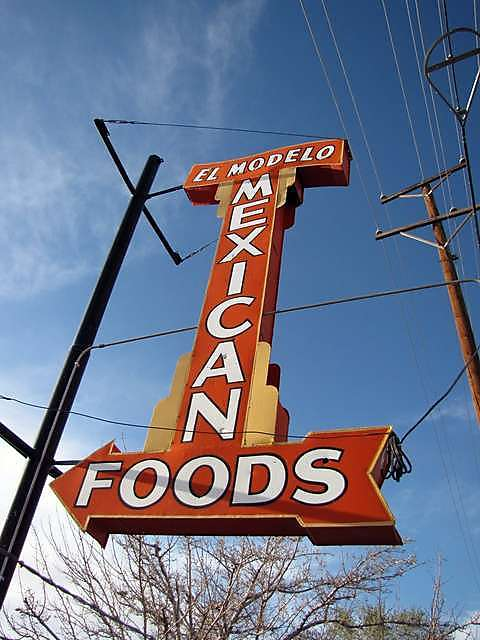
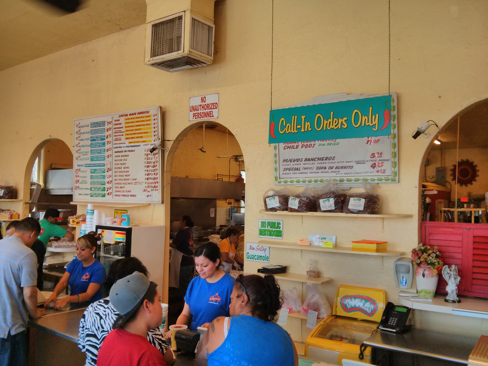
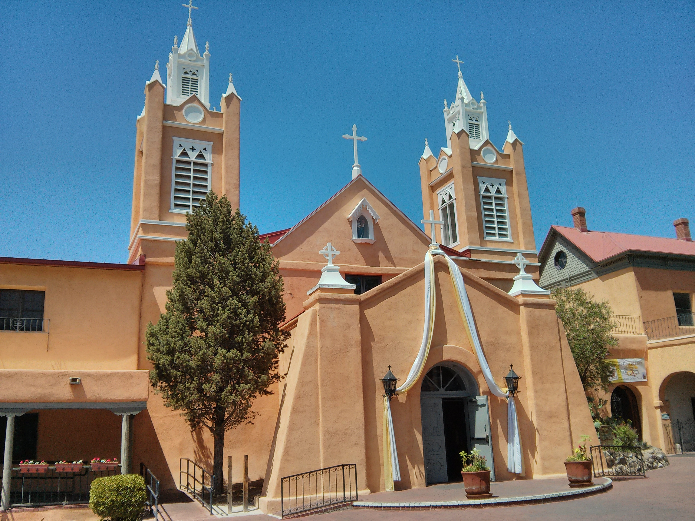
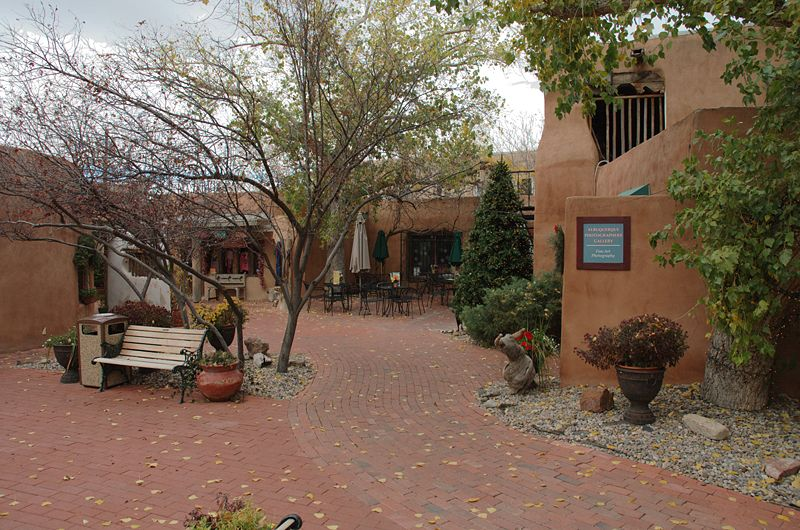
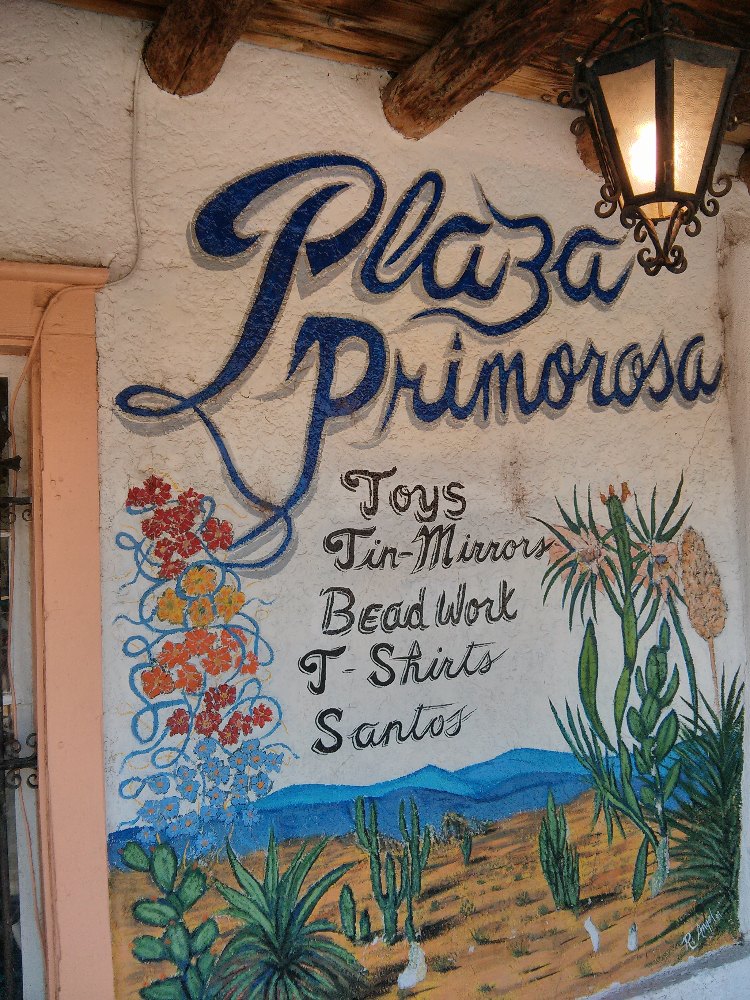
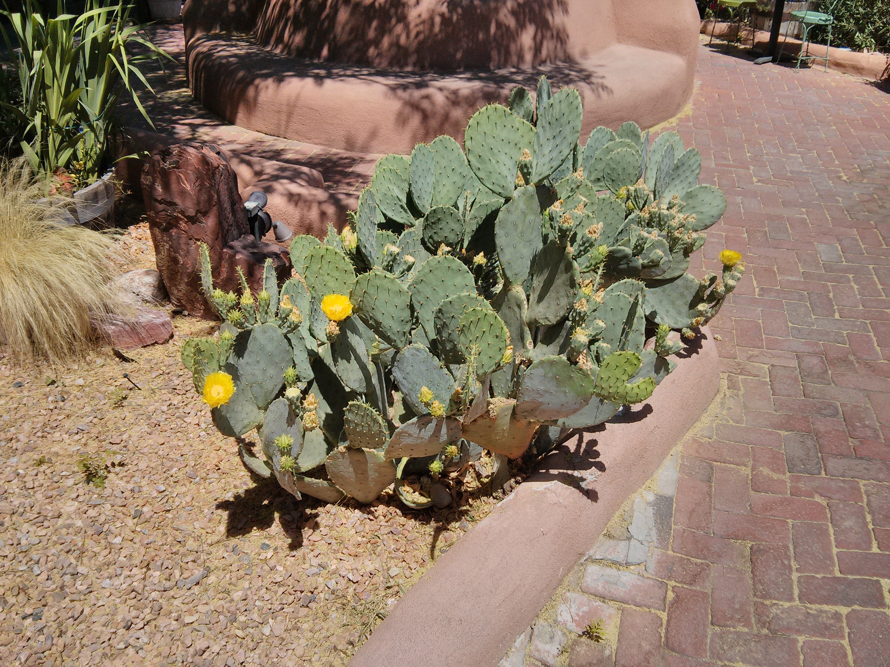
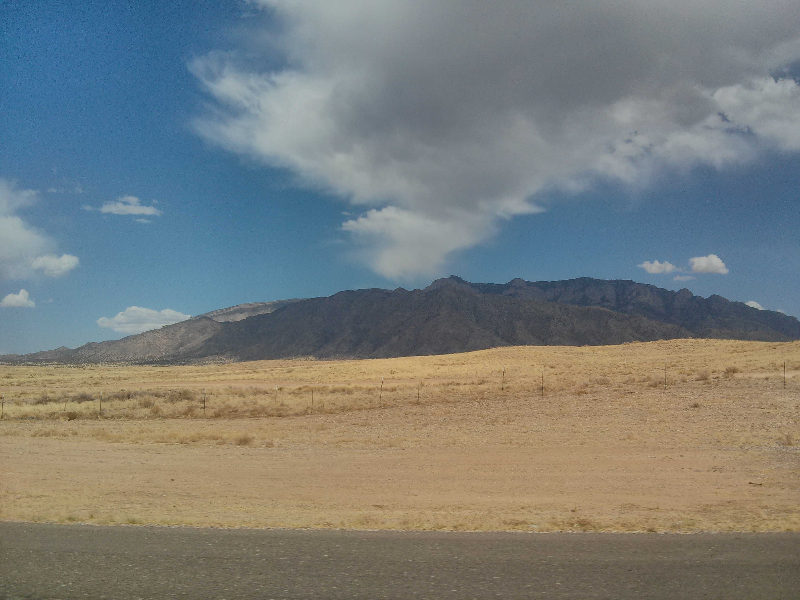

I’ve wanted to visit [Santa Fe](https://en.wikipedia.org/wiki/Santa_Fe,_New_Mexico) again for as long as I can remember. We recently got the opportunity, having planned a four day road trip from Albuquerque to Denver.

We flew in to Albuqurque Monday morning. We could tell we were somewhere far from Toronto right away - [Banana Yucca](http://en.wikipedia.org/wiki/Yucca_baccata) plants decorated the airport grounds, the desert stretched out around us with low scrub trees rising up occasionally out of the low hills and sandy scrub grass.

**Flowering Yucca Plants**  

We picked up the rental car and headed to [El Modelo](http://www.elmodelomexicanfoods.com/) for lunch.

* * *

## Lunch: El Modelo

We ordered two "Mexican Plates". As per the menu, they include Tamale, Taco, Enchilada, Rice, Refried Beans, Red Chile Chorizo, Spare Rib, Chips and 2 Sopaipillas. It was cheap and cheerful at its best - tasty, generous, served hot and quickly. Two people really only need one dinner, as they’re really big! The sopaipillas were particularly good. It was the first of many meals we ate al fresco, as the weather was beautiful.

**El Modelo’s Interior**  

* * *

## Old Town Albuquerque

Next we headed to [Old Town](http://www.albuquerqueoldtown.com/) in Albuqueque, a fantastic example of early New Mexico architecture that dates back to 1706. It’s anchored by San Felipe de Neri Church, built in 1793.

**San Felipe de Neri Church**  

The town square is a popular destination with tourists, with lots of shops selling native [Zuni](http://en.wikipedia.org/wiki/Zuni_people), [Hopi](http://en.wikipedia.org/wiki/Hopi_people), and [Navajo](http://en.wikipedia.org/wiki/Navajo_people) art and jewelry, as well as Spanish Colonial inspired art.

**Old Town Square**  

**Signage**  

**Prickly Pear Cactus**  

* * *

## Heading to Santa Fe

Next we got back in the car and headed out along Interstate 25 to Santa Fe.

* * *

## References

- [El Modelo](http://www.elmodelomexicanfoods.com/)'s website
- Wikipedia’s article on [Old Town Albuquerque](http://en.wikipedia.org/wiki/Old_Town_Albuquerque)
- [Albuquerque OldTown](http://commons.wikimedia.org/wiki/File%3AAlbuquerque_OldTown.jpg) photograph by Malcolm Tredinnick from Sydney, Australia [CC-BY-2.0](http://creativecommons.org/licenses/by/2.0), via Wikimedia Commons from Wikimedia Commons
- El Modelo Sign photograph found at [Urbanspoon’s El Modelo](http://www.urbanspoon.com/rph/60/650392/201482/albuquerque-el-modelo-mexican-foods-el-modelo-mexican-foods-photo) article
- Photograph of flowering Banana Yucca plants found at www.history.com’s [New Mexico Photo Gallery](http://www.history.com/photos/new-mexico/photo1)

<table style="margin:.2em 0;"><tbody><tr valign="top"><td style="padding:.5em;">
<b><u>Note</u></b>
</td><td style="border-left:3px solid #e8e8e8;padding:.5em;">
<b>Southwest Series</b>
This article is part of a series on travel within the <a href="http://www.kylehodgson.com/tag/southwest/">Southwestern US</a>.</td></tr></tbody></table>
