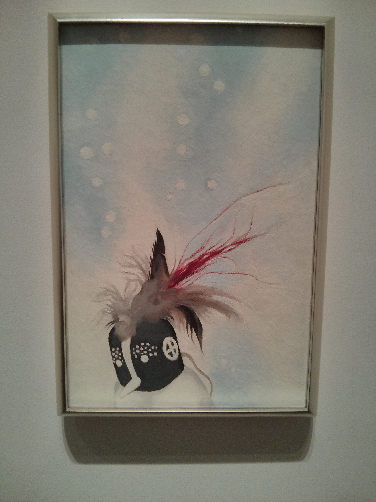
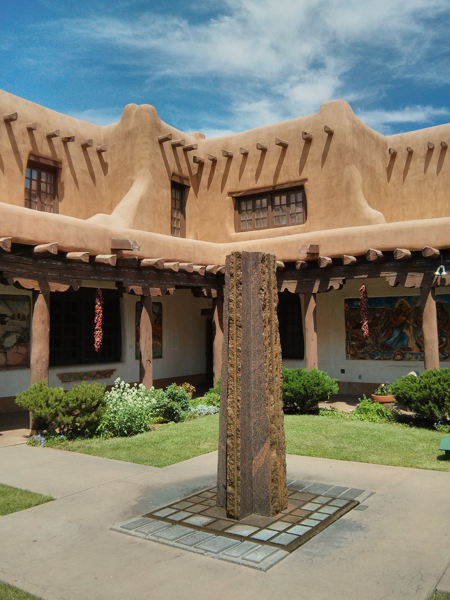
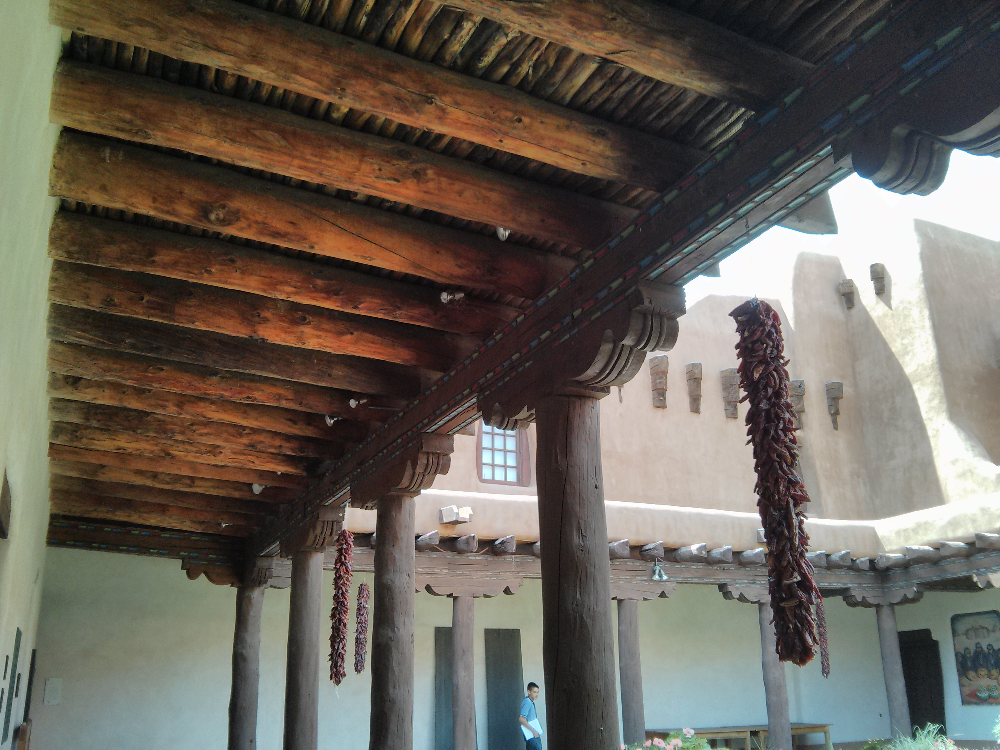
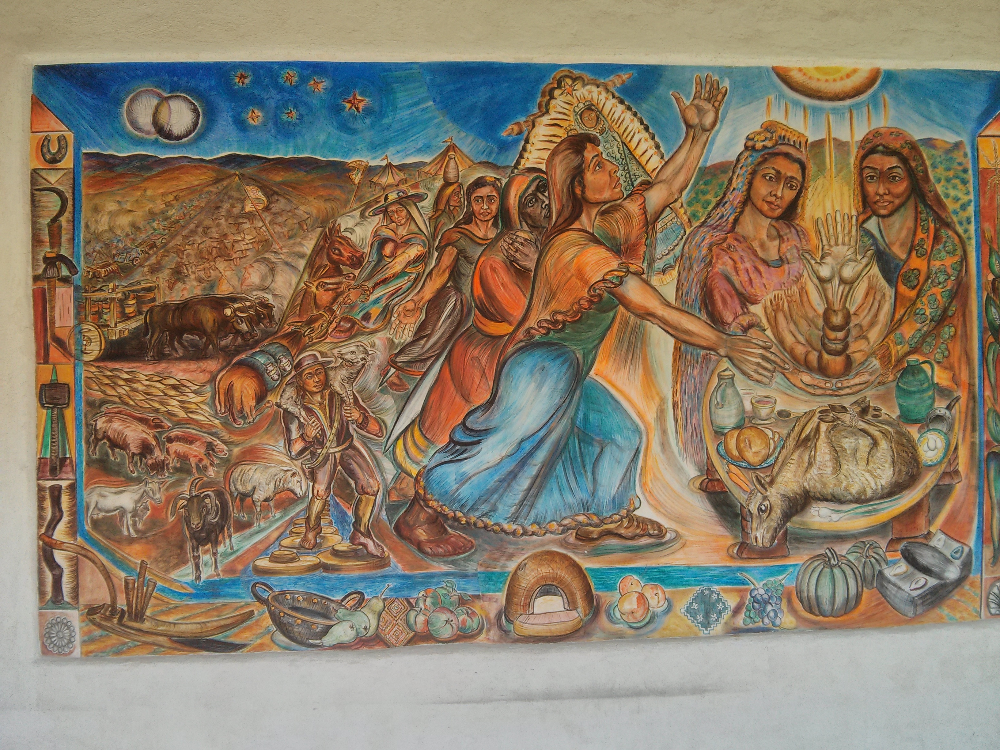
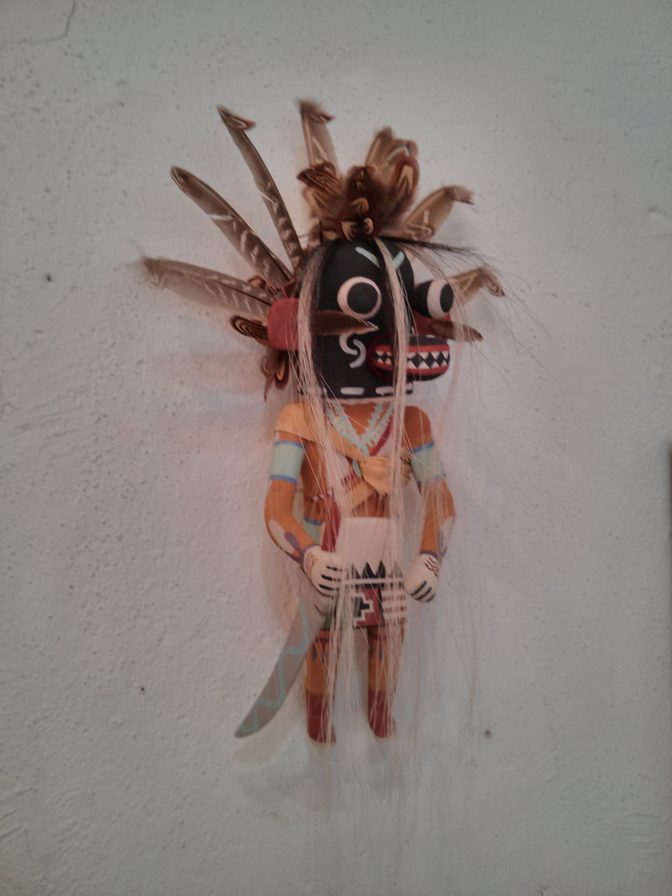
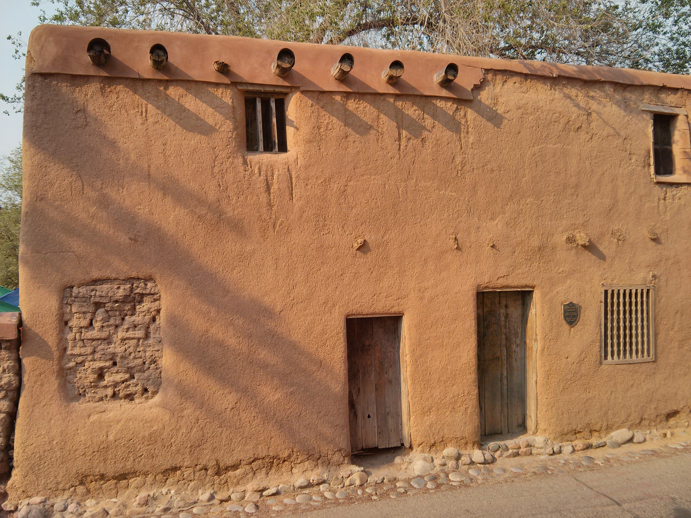
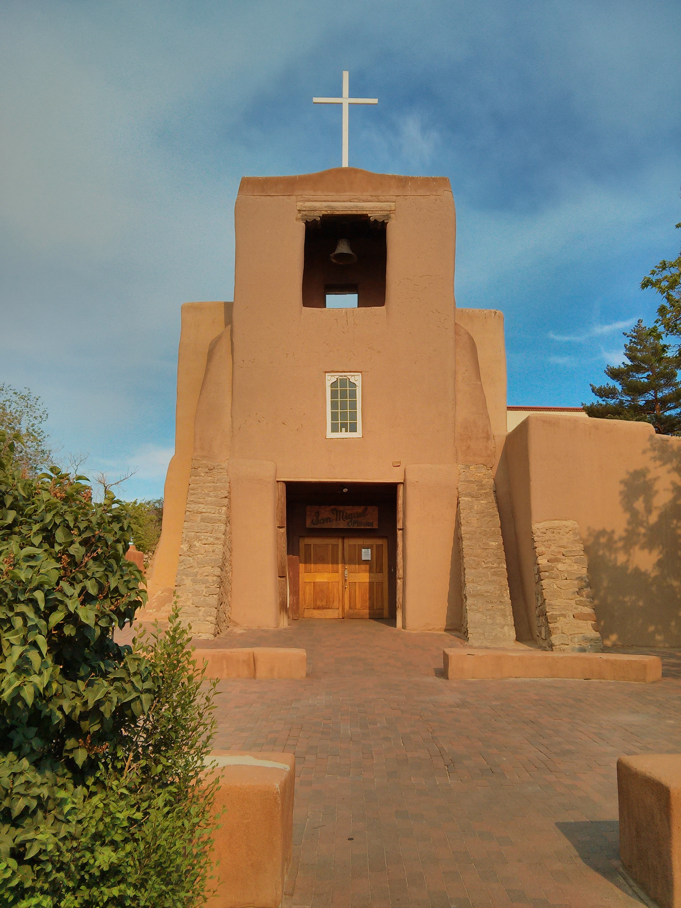
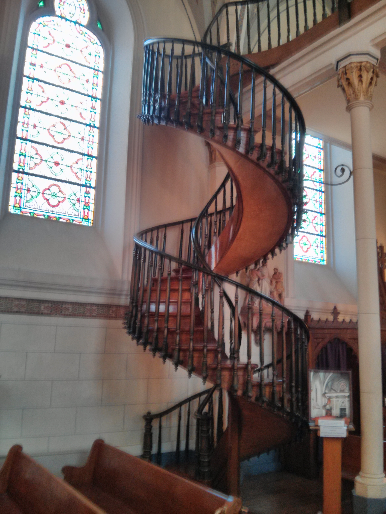

When the Spanish came to the area that’s now called Santa Fe, they would have found a number of Pueblo villages along what is now called the Santa Fe river. Today, it’s a city of nearly 70,000 that offers a world class mixture of people, [Pueblo Revival style architecture](http://en.wikipedia.org/wiki/Pueblo_Revival_Style_architecture), distinct landscape, and a rich arts heritage that can’t be found elsewhere.

* * *

## Georgia O’Keefe Museum

We started out at the Georgia O’Keefe Museum just off of the Plaza. The museum’s collection focuses on the artist’s work while she was in New Mexico - it’s easy to see the impact that the land and people had on her work. O’Keefe painted what she saw - the stripped down abstract landscapes are a sensual and powerful study of color and light. I personally enjoyed her focus on native religious artifacts known as "Katsina", or popularly referred to as "Kachina dolls".

**Kokopelli with Snow, 1942**  

The museum offers a guided tour that was a highlight of the trip. Our guide really helped us connect with the work, providing context and color around the artist and the history of the region.

* * *

## New Mexico Museum of Art

A fantastic example of Pueblo Revival Style, we were drawn in to the New Mexico Museum of Art. The Museum’s central courtyard in particular caught the light beautifully. I really loved an exhibition by a contemporary multimedia artist, [Peter Sarkisian](http://nmartmuseum.org/site/explore/current/peter-sarkisian-video-works-1994-2011.html).

**Central Courtyard**  

**Rafters**  

**Courtyard Fresco**  

* * *

## Santa Fe Plaza

We went in to so many shops in Santa Fe Plaza, most of them with jewelry of varying quality - some of it was really pretty, and the work quite good. However, I most enjoyed a shop called [Bahti Indian Art](http://www.bahti.com/) that has some really amazing artifacts, and modern [Katsina](http://en.wikipedia.org/wiki/Kachina) among other things.

**Hopi Katsina from Bahti Indian Art**  

* * *

## Santa Fe Architecture

Just off of the plaza is one of Santa Fe’s most charming residences, known as the [Oldest House in the USA](https://en.wikipedia.org/wiki/Oldest_House_in_the_USA). While it’s not actually the oldest, it is thought to have been built in 1646.

**Oldest House in the USA**  

* * *

## Lunch: La Casa Sena

We stopped for lunch at a really great place that caught our eye called [La Casa Sena](http://www.lacasasena.com/), situated in a beautiful courtyard. The sandwiches and salads were really great, and the scene was charming and peaceful. The BLT was the best we’ve tasted, and the Grilled Chicken Sandwich was awesome. Super high quality, great flavors, excellent service.

* * *

## San Miguel Mission

One of my favorite buildings in New Mexico is [San Miguel Mission](http://en.wikipedia.org/wiki/San_Miguel_Mission), as I grew up with a portrayal of it that my aunt had painted. Built in 1610, it’s thought to be one of the oldest standing church structures in the US.

**San Miguel Mission Chapel**  

* * *

## Loretteo Chapel

An homage to [Saint Chapelle](http://en.wikipedia.org/wiki/Sainte-Chapelle) in Paris, Loretto Chapel is perhaps best known for its amazing staircase. As the story goes, a mysterious, anonymous craftsman showed up at the chapel every day for six months, building by hand this amazing staircase. With no central support, its graceful curves seem to simply hang in the air. As the story goes, it was originally built without even the railing, which was added later.

**Staircase at Loretto Chapel**  

<table style="margin:.2em 0;"><tbody><tr valign="top"><td style="padding:.5em;">
<b><u>Note</u></b>
</td><td style="border-left:3px solid #e8e8e8;padding:.5em;">
<b>Southwest Series</b>
This article is part of a series on travel within the <a href="http://www.kylehodgson.com/tag/southwest/">Southwestern US</a>.</td></tr></tbody></table>

* * *

## References

- [Wikipedia article: Santa Fe](https://en.wikipedia.org/wiki/Santa_Fe,_New_Mexico)
- [Wikipedia article: Puebloan Peoples](https://en.wikipedia.org/wiki/Pueblo_Indian)
- [Wikipedia article: Pueblo Revival Style architecture](http://en.wikipedia.org/wiki/Pueblo_Revival_Style_architecture)
- [Georgia O’Keefe museum](http://www.okeeffemuseum.org/) allows photography of certain images, such as Kokopelli With Snow, 1942 above
- Hopi Katsina, [Bahti Indian Arts](http://www.bahti.com/), Santa Fe
- [New Mexico Museum of Art](http://nmartmuseum.org/)
- [Wikipedia article: Katsina](http://en.wikipedia.org/wiki/Kachina)
