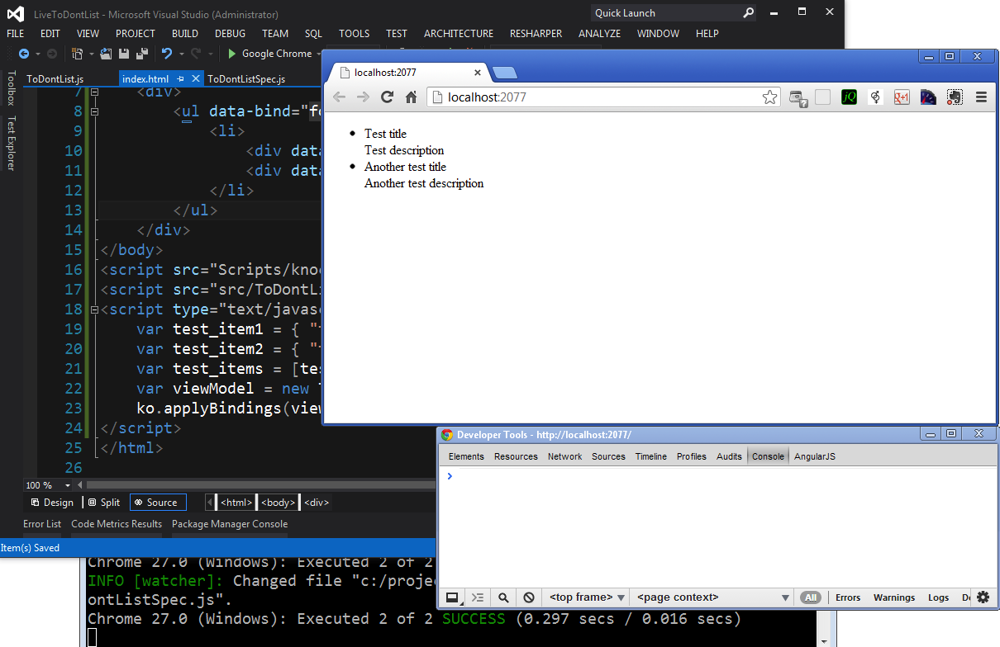

In our [last post](http://kylehodgson.com/2013/05/29/test-driven-development-with-knockoutjs-visualstudio-and-karma/), we created a ViewModel which models the basic functionality we would like on the page. As a reminder, we have a Knockout "observable array" of items suitable for binding; each item is a JavaScript object containing a title and description in addition to a value called complete which indicates if this item has been completed. Our ViewModel function object accepts a parameter of any initial items we may need to load in to to our list from the server. We have a method called add\_item which can add new items to our list, and we have a test suite that ensures that all of this is working. So far, all of this is inside a single file called ToDontListSpec.js.

**Starting point**

<table border="0" bgcolor="#e8e8e8" width="100%" cellpadding="10"><tbody><tr><td><pre><tt><b>var</b> ToDontList = <b>function</b> (initialItems) {
    <b>var</b> self = <b>this</b>;

    <b>if</b> (!(initialItems <b>instanceof</b> Array))
        initialItems = [];
    self.items = ko.<b>observableArray</b>(initialItems);

    self.add_item = <b>function</b> (item) {
        self.items.<b>push</b>(item);
    };
};

<b>describe</b>("ToDontList View Model", <b>function</b> () {
    <b>var</b> test_item1 = { "title": "Test title",
      "description": "Test description", "complete": <b>false</b> };
    <b>var</b> test_item2 = { "title": "Another test title",
      "description": "Another test description", "complete": <b>false</b> };
    <b>var</b> test_items = [test_item1, test_item2];

    <b>it</b>("Should be able to add items", <b>function</b>() {
        <b>var</b> target = <b>new</b> <b>ToDontList</b>();
        target.<b>add_item</b>(test_item1);
        <b>expect</b>(target.<b>items</b>()[0].title).<b>toBe</b>(test_item1.title);
    });

    <b>it</b>("Should be able to view existing items", <b>function</b> () {
        <b>var</b> target = <b>new</b> <b>ToDontList</b>(test_items);
        <b>expect</b>(target.<b>items</b>().length).<b>toBe</b>(2);
        <b>expect</b>(target.<b>items</b>()[0].title).<b>toBe</b>(test_item1.title);
        <b>expect</b>(target.<b>items</b>()[1].title).<b>toBe</b>(test_item2.title);
    });
});</tt></pre></td></tr></tbody></table>

* * *

## Creating the UI

- Add a new item to the project (Ctrl-shift-a)
- Choose HTML page, name it index.html
- Add Knockout to the page:

**Adding Knockout to the bottom of the page**

<table border="0" bgcolor="#e8e8e8" width="100%" cellpadding="10"><tbody><tr><td><pre><tt>&lt;/body&gt;
&lt;script src="Scripts/knockout-2.2.1.js"&gt;&lt;/script&gt;
&lt;/html&gt;</tt></pre></td></tr></tbody></table>

- Add a list with a data-bind like this: <ul data-bind="foreach: items">
- Inside that <ul> tag add an <li> tag. We’ll place each "to Don’t" item here
- Inside the list item we’ll create divs for the title and the description

**Creating a list to hold data bound elements**

<table border="0" bgcolor="#e8e8e8" width="100%" cellpadding="10"><tbody><tr><td><pre><tt>&lt;ul data-bind="foreach: items"&gt;
  &lt;li&gt;
    &lt;div data-bind="text: title"&gt;&lt;/div&gt;
    &lt;div data-bind="text: description"&gt;&lt;/div&gt;
  &lt;/li&gt;
&lt;/ul&gt;</tt></pre></td></tr></tbody></table>

- We’ll need to tell Knockout to boot, and inform it of what ViewModel we want to use.

**Booting Knockout**

<table border="0" bgcolor="#e8e8e8" width="100%" cellpadding="10"><tbody><tr><td><pre><tt>&lt;script type="text/javascript"&gt;
  <b>var</b> viewModel = <b>new</b> <b>ToDontList</b>();
  ko.<b>applyBindings</b>(viewModel);
&lt;/script&gt;</tt></pre></td></tr></tbody></table>

Our JavaScript code for the ViewModel is still in the test spec. Now that we need it in its own file, it’s a good time to do that.

* * *

## Creating the ViewModel file

At this stage, our tests still pass, but we’ve created a web page that doesn’t work. If we hit ctrl-F5 to run the page, and then ctrl-shift-I to pull up Chrome’s debugger (assuming you are running Chrome), you should see the following error in the console:

<table border="0" bgcolor="#e8e8e8" width="100%" cellpadding="10"><tbody><tr><td><pre><tt>Uncaught ReferenceError: ToDontList is not defined</tt></pre></td></tr></tbody></table>

- Highlight the ViewModel function object from our specification in Visual Studio
- Cut the text of it with ctrl-x
- Save the changes to our specification - at this stage, the tests should fail (as ToDontList is no longer defined)
- Click the src folder in Visual Studio and use ctrl-shift-a to create a new file, choose JavaScript File as the type
- Name the file ToDontList.js
- Paste the code in to this file, save it - at this stage, the tests should pass again
- We’ll add the reference to this new file between the Knockout import and the <script> tag that boots knockout

At this stage we have a web view that should correctly import Knockout, import our ViewModel, boot knockout and apply any bindings it finds in the HTML to ViewModel elements. To simulate pulling data in from the server, we can borrow the array of test items from our specification like so:

**Wiring up test data for our ViewModel**

<table border="0" bgcolor="#e8e8e8" width="100%" cellpadding="10"><tbody><tr><td><pre><tt>&lt;/body&gt;
&lt;script src="Scripts/knockout-2.2.1.js"&gt;&lt;/script&gt;
&lt;script src="src/ToDontList.js"&gt;&lt;/script&gt;
&lt;script type="text/javascript"&gt;
    <b>var</b> test_item1 = { "title": "Test title",
      "description": "Test description", "complete": <b>false</b> };
    <b>var</b> test_item2 = { "title": "Another test title",
      "description": "Another test description", "complete": <b>false</b> };
    <b>var</b> test_items = [test_item1, test_item2];
    <b>var</b> viewModel = <b>new</b> <b>ToDontList</b>(test_items);
    ko.<b>applyBindings</b>(viewModel);
&lt;/script&gt;
&lt;/html&gt;</tt></pre></td></tr></tbody></table>

If we go to Chrome now and reload the page, we should see that our test items each show up now.

**Viewing the page**  

Here are the files we’ve created to date and their current state:

**spec/ToDontListSpec.js**

<table border="0" bgcolor="#e8e8e8" width="100%" cellpadding="10"><tbody><tr><td><pre><tt><b>describe</b>("ToDontList View Model", <b>function</b> () {
    <b>var</b> test_item1 = { "title": "Test title",
      "description": "Test description", "complete": <b>false</b> };
    <b>var</b> test_item2 = { "title": "Another test title",
      "description": "Another test description", "complete": <b>false</b> };
    <b>var</b> test_items = [test_item1, test_item2];

    <b>it</b>("Should be able to add items", <b>function</b>() {
        <b>var</b> target = <b>new</b> <b>ToDontList</b>();
        target.<b>add_item</b>(test_item1);
        <b>expect</b>(target.<b>items</b>()[0].title).<b>toBe</b>(test_item1.title);
    });

    <b>it</b>("Should be able to view existing items", <b>function</b> () {
        <b>var</b> target = <b>new</b> <b>ToDontList</b>(test_items);
        <b>expect</b>(target.<b>items</b>().length).<b>toBe</b>(2);
        <b>expect</b>(target.<b>items</b>()[0].title).<b>toBe</b>(test_item1.title);
        <b>expect</b>(target.<b>items</b>()[1].title).<b>toBe</b>(test_item2.title);
    });
});</tt></pre></td></tr></tbody></table>

**src/ToDontList.js**

<table border="0" bgcolor="#e8e8e8" width="100%" cellpadding="10"><tbody><tr><td><pre><tt><b>var</b> ToDontList = <b>function</b> (initialItems) {
    <b>var</b> self = <b>this</b>;

    <b>if</b> (!(initialItems <b>instanceof</b> Array))
        initialItems = [];
    self.items = ko.<b>observableArray</b>(initialItems);

    self.add_item = <b>function</b> (item) {
        self.items.<b>push</b>(item);
    };
};</tt></pre></td></tr></tbody></table>

**index.html**

<table border="0" bgcolor="#e8e8e8" width="100%" cellpadding="10"><tbody><tr><td><pre><tt><b>&lt;!DOCTYPE</b> html<b>&gt;</b>
<b>&lt;html</b> xmlns="http://www.w3.org/1999/xhtml"<b>&gt;</b>
<b>&lt;head&gt;</b>
    <b>&lt;title&gt;&lt;/title&gt;</b>
<b>&lt;/head&gt;</b>
<b>&lt;body&gt;</b>
    <b>&lt;div&gt;</b>
        <b>&lt;ul</b> data-bind="foreach: items"<b>&gt;</b>
            <b>&lt;li&gt;</b>
                <b>&lt;div</b> data-bind="text: title"<b>&gt;&lt;/div&gt;</b>
                <b>&lt;div</b> data-bind="text: description"<b>&gt;&lt;/div&gt;</b>
            <b>&lt;/li&gt;</b>
        <b>&lt;/ul&gt;</b>
    <b>&lt;/div&gt;</b>
<b>&lt;/body&gt;</b>
<b>&lt;script</b> src="Scripts/knockout-2.2.1.js"<b>&gt;&lt;/script&gt;</b>
<b>&lt;script</b> src="src/ToDontList.js"<b>&gt;&lt;/script&gt;</b>
<b>&lt;script</b> type="text/javascript"<b>&gt;</b>
    <b>var</b> test_item1 = { "title": "Test title",
      "description": "Test description", "complete": <b>false</b> };
    <b>var</b> test_item2 = { "title": "Another test title",
      "description": "Another test description", "complete": <b>false</b> };
    <b>var</b> test_items = [test_item1, test_item2];
    <b>var</b> viewModel = <b>new</b> <b>ToDontList</b>(test_items);
    ko.<b>applyBindings</b>(viewModel);
<b>&lt;/script&gt;</b>
<b>&lt;/html&gt;</b></tt></pre></td></tr></tbody></table>

**karma.conf.js**

<table border="0" bgcolor="#e8e8e8" width="100%" cellpadding="10"><tbody><tr><td><pre><tt><i>// Karma configuration</i>
<i>// Generated on Thu May 30 2013 14:17:27 GMT-0400 (Eastern Daylight Time)</i>

<i>// base path, that will be used to resolve files and exclude</i>
basePath = '';

<i>// list of files / patterns to load in the browser</i>
files = [
  JASMINE,
  JASMINE_ADAPTER,
  'Scripts/knockout-2.2.1.js',
  'src/**/*.js',
  'spec/**/*Spec*.js'
];

<i>// list of files to exclude</i>
exclude = [

];

<i>// test results reporter to use</i>
<i>// possible values: 'dots', 'progress', 'junit'</i>
reporters = ['progress'];

<i>// web server port</i>
port = 9876;

<i>// cli runner port</i>
runnerPort = 9100;

<i>// enable / disable colors in the output (reporters and logs)</i>
colors = <b>true</b>;

<i>// level of logging</i>
<i>// possible values: LOG_DISABLE || LOG_ERROR || LOG_WARN || LOG_INFO || LOG_DEBUG</i>
logLevel = LOG_INFO;

<i>// enable / disable watching file and executing tests whenever any file changes</i>
autoWatch = <b>true</b>;

<i>// Start these browsers, currently available:</i>
<i>// - Chrome</i>
<i>// - ChromeCanary</i>
<i>// - Firefox</i>
<i>// - Opera</i>
<i>// - Safari (only Mac)</i>
<i>// - PhantomJS</i>
<i>// - IE (only Windows)</i>
browsers = ['Chrome'];

<i>// If browser does not capture in given timeout [ms], kill it</i>
captureTimeout = 60000;

<i>// Continuous Integration mode</i>
<i>// if true, it capture browsers, run tests and exit</i>
singleRun = <b>false</b>;</tt></pre></td></tr></tbody></table>

* * *

## Progress so far

We now have a basic web view created that can view what items exist. In the next article, we’ll explore creating the web form to create new items and binding this form to the ViewModel’s add\_item method.

<table style="margin:.2em 0;"><tbody><tr valign="top"><td style="padding:.5em;">
<b><u>Note</u></b>
</td><td style="border-left:3px solid #e8e8e8;padding:.5em;">This article is part of a multi-part series on Test Driven JavaScript development. The code for this particular project can be found on <a href="https://github.com/kylehodgson/ToDontList">GitHub</a>. You can view all the articles by viewing the <a href="http://kylehodgson.com/tag/tdd-knockout/">tdd-knockout</a> tag. This series also has a relevant <a href="https://github.com/kylehodgson/ToDontList">GitHub repository</a>.</td></tr></tbody></table>
