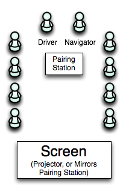

* * *

## "Bring a Laptop, Will Code" Events

I’ve always found events where you are expected to participate by coding the most interesting. You can see how your fellow developers think, possibly see other environments, and actually sharpen your skills. Often during the work day, developers have time pressures and business interests to factor in - this style of event creates a social setting around the idea of simply practicing the art of software development. Besides, these events are far easier to facilitate - you don’t need to find speakers or plan content, the participants themselves bring that.

There are several successful formats for community events. Each one has different properties and provides good opportunities for different kinds of interactions.

* * *

## Hack Night

This format often brings together people who share an interest in one particular language. Participants start by gathering together, hopefully around a whiteboard or flip chart. Each participant will introduce themselves, perhaps share a tip that they’ve recently learned, and optionally mention a project that they might be interested in doing. A Facilitator will write down the different projects on the whiteboard. After everyone has introduced themselves, the facilitator will list off the different projects, and point to the person who offered to lead that project. People vote with their feet by gathering around the different group leaders. As long as a group gets a few people, they’ll find a common area to sit down and begin work.

With a little luck, groups will write a user story that they’re trying to accomplish, perhaps even form separate streams of work, form pairs and begin coding.

At the end of the hack night, groups share their experiences or things they’ve learned, and demo features that they developed.

Hack nights are easy to organize. All a organizer needs to do is have space, find people, and facilitate, and optionally cater the event. The participants do the rest.

* * *

## Coding Dojo

The Coding Dojo format works well to let programmers work together to learn a new language or focus on some other craftsmanship purpose. This format works well when its repeated often, possibly weekly, with the same core group. It can take anywhere from 90 minutes to two hours.

Seating should be arranged in a semi-circle around a projector screen. At the center of the semi-circle should be a pairing station, the screen of which is being projected on the screen so that all participants can see. A timer is set (typically with either five or seven minutes), and the driver and navigator will then begin writing tests to solve a particular problem. When the timer rings, the navigator becomes the driver, the driver goes out in to the circle, and someone from the circle becomes the navigator.

**Dojo setup**  

The problem could be scoring poker hands, implementing Conway’s Game of Life, Dining Philosophers. It’s not important that the problem is solved during the dojo. Code should be shared on GitHub afterwards, but the group will start over from scratch at the next meetup.

Many dojo groups I’ve encountered have successfully met weekly for a stretch of six or seven weeks, and occasionally take breaks. THey have been fairly well attended with between five and fifteen people each week. Most dojo groups have chosen a language to learn, and then worked on solving one or two problems in that language before possibly considering another language. The first few meetups typically don’t get very far, but in time the group will likely be learning together and getting farther and farther each week.

This format is particularly well suited to providing food (usually pizza), as you’re not always coding, and can easily watch the action on the screen while eating.

Coding Dojos are fairly easy to organize. The organizer needs to set up a pairing station and projector, find people and facilities, choose a few possible challenges, and optionally cater the event.

* * *

## Code Retreat

Popularized by the "Global Day of Code Retreat" movement, the Code Retreat format works well to let programmers experience new things and work on craftsmanship. Programmers are expected to bring a laptop with at least one working environment on it - they should know how to create a project, add a simple test and get it to fail. This format works well for all day events, and also half day / evening events.

The group begins by gathering together, and describing the challenge. Often the challenge is Conway’s Game of Life, though any particular group of people may bore with this if they’ve solved it recently and choose other puzzles to solve. The facilitator describes the challenge, and lets the participants know the rules: everyone will pair up, a timer will be set to 45 minutes, and the pairs will work together to solve the challenge. Code will be deleted at the end of 45 minutes, and then the pairs will be switched up, and then try to solve the same challenge again.

Each participant will introduce themselves with their name, and mention what software environment(s) they have with them that day. When developers pair up, they can pair up based on their interest level in seeing some language they haven’t seen before, or sticking to languages they know well as they choose.

Often, Code Retreat events will attempt to escalate the requirements after each session. For instance, in the second session participants might be required to follow "[tell, don’t ask](http://martinfowler.com/bliki/TellDontAsk.html)". In the next session they might be forbidden from using conditionals. In the third session they may not be allowed to talk to one another (forcing the communication to be in the code and tests).

This event goes best when participants can at least try to solve the challenge two or three times.

Code Retreats are fairly easy to organize. The organizer needs to set up desks for people to pair at, find people and facilities, choose a challenge, and optionally cater the event.

[More on the Code Retreat Movement](http://www.coderetreat.org)

* * *

## On Finding People

There are a few well proven techniques for creating an audience for your group. Though it isn’t free, [Meetup](http://www.meetup.com) makes things particularly simple. It not only provides you with an RSVP system, it also allows you to easily get on the radar of existing Meetup members.

Another well proven technique is to host an event for your software team, and any adjoining teams that you may work with. This is a good solution for creating and fostering community between different software teams. In this case you might also be able to borrow meeting rooms for the event. Boardrooms and conference rooms with desks and chairs work well for all the events talked about here.

* * *

## Last Thoughts

Try to keep an open mind, and follow the "don’t be a jerk" rule. It’s not about showing off your m4d sk1llz, its about learning about others. Whatever format you choose, above all remember to have fun!
